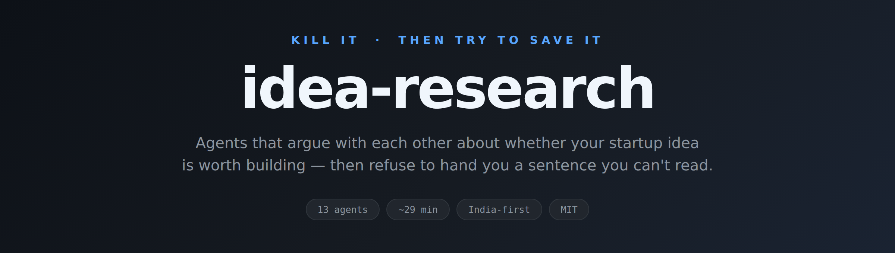
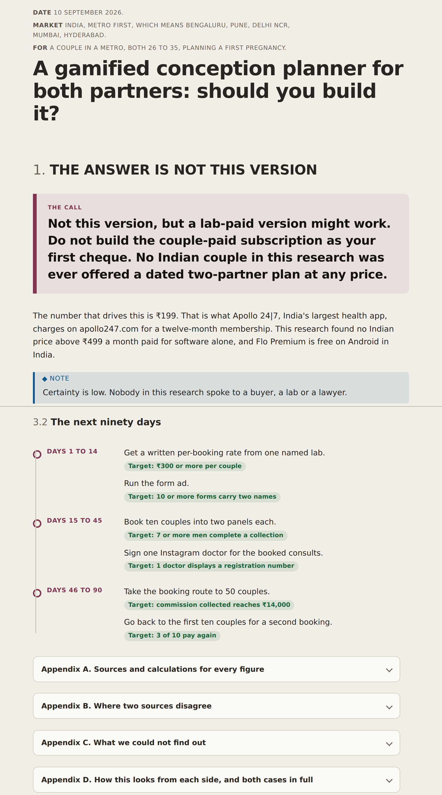
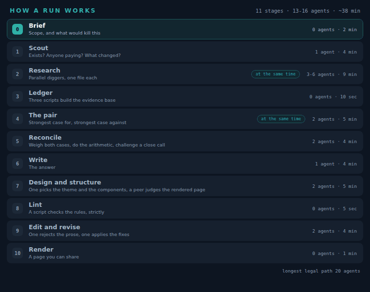
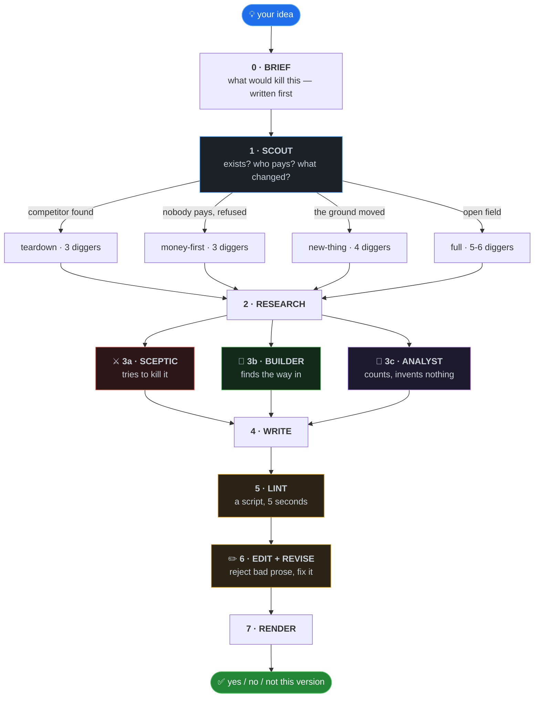
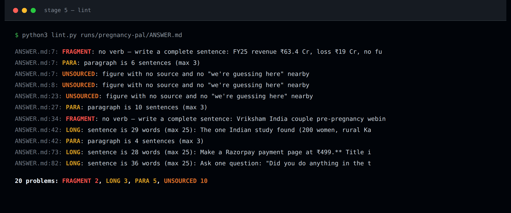

<div align="center">



<br>

**Ask any AI "is this a good startup idea?" and you get a confident yes.**
**This one hires a sceptic to kill it, a builder to save it, and an editor to make sure you can read the result.**

<br>

[](LICENSE)
[](https://code.claude.com/docs/en/skills)
[](https://agentskills.io)
[](#-how-a-run-works)
[](#-how-a-run-works)
[](CONTRIBUTING.md)

<br>

[Try it](#-try-it-in-30-seconds) · [How it works](#-how-a-run-works) · [The agents](#-the-four-agents-that-matter) · [Install](#-install) · [Make it yours](#-make-it-yours)

</div>

<br>

<div align="center">
  
  <br>
  <sub><b>A real run.</b> The idea, the companies that already failed at it, and what people actually pay for.</sub>
</div>

<br>

## ⚡ Try it in 30 seconds

```bash
claude plugin marketplace add rishabhrawat35/idea-research
claude plugin install idea-research@idea-research
```

Restart Claude Code, then type:

```
idea-research: an app that helps small Indian gyms manage member payments
```

No servers. No API keys. No database. 🎉

<br>

## 🎯 The problem it solves

An AI judging an idea has two ways to be wrong, and most tools only avoid one.

| | Mistake | What it looks like | How this avoids it |
|:--:|---|---|---|
| ☠️ | **Yes to a corpse** | The idea was tried and refused. Nobody mentions the bodies. | An agent is paid to kill it and name who died |
| 🚀 | **No to something new** | Nobody paid to summon a car by phone before GPS phones existed | Scout asks what changed in the last 24-36 months |

Those look identical if you only count today's revenue. Telling them apart is the whole job.

<br>

## 🔄 How a run works

<div align="center">
  
</div>



**Eight stages · 11-13 agents · about 29 minutes.** Stage 1 often ends it in five.

> 💨 **In a hurry?** `idea-research quick: <idea>` runs stages 0, 1, 2, 4 and 5 only. Three diggers, no panel, no editor. About 14 minutes.

<br>

### 🔀 Scout decides how expensive the rest gets

| Scout finds | Run becomes | Diggers |
|---|---|:--:|
| 🏢 Funded competitor, nothing has changed | **Teardown** — take them apart | 3 |
| 💸 Nobody pays, people already refused | **Money-first** — find any proof of payment | 3 |
| 🌱 Nobody pays, **but the ground moved** | **New-thing** — what would have to be true | 4 |
| 🌍 Actually open | **Full** | 5-6 |

**New-thing mode is the one most tools don't have.** If Scout finds that the ground moved recently, "nobody pays today" stops being evidence of anything.

<br>

## 🧪 Nothing ships unedited

Every writing failure this system ever had was caught by a human, not by a rule. So the last third of the pipeline exists to catch them first.

### A script, not a vibe

<div align="center">
  
</div>

<br>

[`lint.py`](skills/idea-research/lint.py) ships next to the skill. Standard library, no dependencies, five seconds.

```bash
python3 lint.py runs/my-idea/ANSWER.md
```

| ✅ It catches | Example it caught |
|---|---|
| Verbless fragments | `FY25 revenue ₹63.4 Cr, loss ₹19 Cr, no funding round since…` |
| Sentences over 25 words | 36-word question in the action list |
| Paragraphs over 3 sentences | a 10-sentence block |
| Figures with no source | ten of them |
| Fake quotes, jargon, banned words | `pass`, `burn`, `moat`, `artefact` |
| Table cells over 15 words | prose hiding in a grid |

It knows which section it's in. Imperatives and budget figures are right in an action list and wrong in an analysis, so it only complains where it should. Tuning it against a real answer took it from **45 false-positive-heavy hits down to 20 real ones**.

### Then an editor who never saw the research

It reads the answer cold, the way you will. It can do exactly three things, and **inventing a fact is not one of them**:

| | |
|---|---|
| 🔁 **FIX** | Replacement built only from words already on the page |
| ✂️ **CUT** | Delete the line |
| ❓ **NEEDS A FACT** | Flag what's missing. It may not supply it. |

A reviser applies the swaps. One round, then it ships. Rules enforced by a script don't drift — *"write plainly"* failed twice, a word list hasn't.

<br>

## 🤖 The four agents that matter

<table>
<tr><td width="25%" valign="top">

### ⚔️ The sceptic

Hunts claims with nothing behind them, Indian realities the research skipped, and the best argument that this fails.

Must say plainly whether nobody pays because people **refused** this, or because it **wasn't possible yet**.

</td><td width="25%" valign="top">

### 🔧 The builder

Exists because a system with only critics rejects everything untried.

Uber had no evidence anyone would summon a car by phone. Airbnb had none that anyone would sleep in a stranger's spare room.

Neither was found by research.

</td><td width="25%" valign="top">

### 🧮 The analyst

Does no research and **may not state a fact that isn't already in a research file**.

Shows the idea from every side, runs the numbers under worse assumptions, and lists every figure with its source.

No score, no grade.

</td><td width="25%" valign="top">

### ✏️ The editor

Never saw the research, so it reads like a stranger.

Checks whether every claim explains itself, whether a number implies more than it proves, and whether a person would say this out loud.

</td></tr>
</table>

<details>
<summary><b>The six things the builder has to find</b> (or say plainly that it can't)</summary>

<br>

| | What it looks for |
|---|---|
| 🖐️ The manual version | Done by hand, badly, for 20 people, this week |
| 🤝 The borrowed version | Whose audience, licence, stock or shelf you rent instead of build |
| 🎯 The narrower version | The one customer who'd pay today, even at 2% of the vision |
| 💰 The different money | Same insight, someone else pays |
| 🐌 The unscalable thing | What you'd do for the first 50 that a funded company never would |
| 🔒 The incumbent's constraint | What they can't do without breaking a payroll or a promise |

**Guardrails so it doesn't become a cheerleader:** every idea under ₹20,000 and two weeks, real named tactics only, **no vote on whether the idea is good**, and it must say "there's no way in" when that's the truth.

</details>

<details>
<summary><b>Who is allowed to state a new fact</b> — the hallucination surface, mapped</summary>

<br>

| Agent | Can add facts? | What stops it |
|---|:--:|---|
| Scout | ✅ from the web | Marked **provisional** — researchers must correct it |
| Researchers | ✅ from the web | Every fact needs a URL or *"this is a guess"* |
| Sceptic | ✅ max 5 searches | Same sourcing rule |
| Builder | ✅ max 5 searches | Same sourcing rule |
| Analyst | ❌ | *"may not state any fact not already in a research file"* |
| Writer | ❌ | *"YOU MAY NOT STATE ANY FACT THAT IS NOT IN THOSE FILES"* |
| Editor | ❌ | Replacements built only from words already on the page |
| Reviser | ❌ | *"You are applying edits, not writing"* |

Four of the eight can't invent anything. The four that can are the ones actually searching.

</details>

<details>
<summary><b>Why the loop can't break</b> — termination, proved</summary>

<br>

It's a straight line. No stage's output can re-trigger an earlier one.

| Repeat point | Cap |
|---|---|
| Check-back agents | 2 |
| Edit rounds | 1 — a second lint failure reports to you, it does not loop |
| Specialists | 2 |
| Total agents | 15, hard ceiling |

Maximum possible path: 1 Scout + 6 researchers + 3 at stage 3 + 2 check-backs + writer + editor + reviser = **15**.

</details>

<br>

## 📄 What you get

`ANSWER.md`, written to be read on a phone at night. Fifteen sections, each with a one-line subtitle.

| § | Section | What's in it |
|:--:|---|---|
| 00 | 🎯 Read this if nothing else | Three lines. Verdict, one reason, one action. |
| 01 | ✅ The answer | Yes, no, or "not this version" |
| 02 | 👥 How this looks from each side | Customer, competitor, investor, regulator, operator |
| 03 | 🤔 Why nobody is doing this | Refused, not yet possible, or untried |
| 04 | 🪦 Who's already tried this | Company, money raised, revenue, where they are now |
| 05 | 💵 Would people actually pay | Real ₹ prices. What nobody has ever paid for. |
| 06 | 📉 If the numbers are wrong | The same model under worse assumptions |
| 07 | 🚪 The way in | The cheapest version that could exist by Friday |
| 08 | 🔑 What has to be true | One sentence |
| 09 | 🧪 How to find out | Under ₹20,000, under two weeks, with a yes/no number |
| 10 | 🎤 Ask 20 people this | Three questions, and exactly who to ask |
| 11 | 📅 The next 90 days | This week, 30 days, 90 days. Each ends in a number. |
| 12 | 📋 Track these four | Beliefs, tests, thresholds, a status column you fill in |
| 13 | 🧾 Where every number came from | Every figure, its source, how many were guesses |
| 14 | 🕳️ What we couldn't find out | Including blocked sources and what was tried instead |

If people have already refused this, it says **"don't build this"** plainly. But it never ends on a no with no way in.

<br>

## 🎨 What changed in the output

Same research engine. The difference is a banned-word list, an editor, and a script.

<table>
<tr><td width="50%" valign="top">

### ❌ Before

> **VERDICT: KILL**
>
> Five of seven lanes could not clear their own kill criteria, and three resolved DEAD.
>
> **THE THREE REAL GAPS**
>
> A priced, zero-human, keepable gynae artefact — the research does not explain this, and that is a hole, not a finding.
>
> **THE ₹20K TEST**
>
> Buy the traffic, because there is no network to borrow.

</td><td width="50%" valign="top">

### ✅ After

> **No. Not the three-phase plan.**
>
> Mylo raised $24.25M and ran your exact plan for eight years. FY25 revenue ₹63.4 Cr, loss ₹19 Cr.
>
> **What has to be true**
>
> Indian couples will pay for guidance before a positive test, with no doctor and no product attached.
>
> **How to find out**
>
> Run Meta ads, ₹12,000 over 7 days, women 26-34, Mumbai and Pune.

</td></tr>
</table>

<br>

<details>
<summary><b>🔍 How it stays honest</b></summary>

<br>

| Mechanism | What it stops |
|---|---|
| Agents write files, orchestrator reads 5-line summaries | The chat filling up and the run forgetting the question |
| Every fact needs a URL, or is marked a guess | Invented numbers passing as facts |
| Scout's findings are marked **provisional** | A wrong fact reaching the next wave labelled "already known" |
| The brief goes into every agent's instructions | Agents wandering into next-door topics |
| Item caps, not word caps | Agents actually obey them |
| *"What would kill this"* written before research | The system rationalising a yes afterwards |

Two more: finding nothing against the idea is treated as **not having looked**, and every finding must matter to someone with no money.

### 🚧 Blocked sources are not an excuse

An early run hit a blocked Reddit and reported it as a limitation. That's a researcher giving up. There's now a ladder, and the file has to say which rungs it tried:

1. 🔎 Search for the content instead of the page — threads get quoted in results
2. 🗣️ A different community: forums, app store reviews, YouTube comments, Trustpilot
3. 🌏 **The same question about another country** — often better evidence, and it feeds the "what changed" test
4. 📚 Someone who already did the reading: market reports, journalism, dissertations
5. 🖥️ The browser tools, if the session has them, and actually go look
6. ✋ Only then *"could not find out"*, listing the five things tried

</details>

<details>
<summary><b>⚡ How it stays fast</b></summary>

<br>

An early version took 35 minutes and 14 agents to produce five findings — two of which arrived in the first five minutes.

| Rule | Why |
|---|---|
| Scout runs alone, first | One agent often ends the run before the expensive part |
| Mode chosen after Scout | No point running six diggers on a settled question |
| One sceptic, not one per researcher | Seven sceptics once reached one conclusion |
| Sceptic, builder and analyst run together | Same wall-clock as running one |
| Check back only on facts you can look up | *"Needs a live test"* doesn't need an agent to say it |
| Shared findings file, read before writing | Stops researchers re-deriving each other |

</details>

<details>
<summary><b>✍️ The banned-word list</b></summary>

<br>

The research was never the weak part. The writing was.

| ❌ Never | ✅ Instead |
|---|---|
| artefact, offering, proposition | the PDF, the app, the thing |
| keepable, actionable, learnings | say what it actually is |
| leverage, unlock, enable | use, let, allow |
| ecosystem, landscape, moat, thesis | name the actual thing |
| pass, burn, traction, TAM, GTM | *"an investor would decline, because…"* |
| "Buy the traffic" | *"Run Meta ads, ₹12,000"* |
| "VERDICT: KILL" | *"Should you build this? No."* |

The system's own vocabulary is banned too. You never see the words *lane*, *verdict*, or *confidence tag*.

**Required:** complete sentences always, nothing over 25 words, three sentences per paragraph, table cells under 15 words, real names and real prices, no invented quotes, and the words *"we're guessing here"* when it's a guess.

</details>

<details>
<summary><b>📁 Files a run creates</b></summary>

<br>

```
runs/<idea>/
├── 00_brief.md      the brief every agent reads first
├── 01_scout.md      does it exist, does anyone pay, what changed
├── _findings.md     running list and corrections
├── lanes/           one file per researcher
├── 02_attack.md     ⚔️  the sceptic
├── 03_build.md      🔧  the builder
├── 04_panel.md      🧮  each side, sensitivity, evidence ledger
├── 05_edit.md       ✏️  what the editor sent back
├── ANSWER.md        📄  what you read
└── report.html      🌐  the same thing as a page
```

Runs are kept. Comparing an idea against the same idea reshaped a month later is one of the more useful things this does.

</details>

<details>
<summary><b>🛠️ When it goes wrong</b></summary>

<br>

| What you see | Why | Fix |
|---|---|---|
| Every idea comes back as no | Builder skipped, or Scout never asked what changed | *"Rerun the builder"* |
| Fragments and slogans | Editor was skipped | Run stages 5 and 6 |
| A file says a source was blocked and stops | The ladder was ignored | *"Send it back, use the ladder"* |
| Everything says the same thing | Idea too broad | Narrow the brief, rerun |
| Sounds like a consultant wrote it | Writing rules ignored | *"Rewrite the answer, follow the banned list"* |
| A number used as proof of something else | Rule 5 ignored | Add it to the lint |
| The builder wrote a pep talk | It thinks it's a coach | *"Real tactics, ₹ and days, no encouragement"* |
| Took over 35 minutes | Scout skipped, or too many specialists | Scout always runs first |

</details>

<details>
<summary><b>🧭 Why it's built this way</b></summary>

<br>

| Choice | Rejected | Reason |
|---|---|---|
| Scout runs first, alone | Straight into full research | One agent often ends the run for 1/14th of the cost |
| Scout asks what changed | Only asking who pays today | *"Nobody pays"* is true of every new category before it exists |
| A builder runs against the sceptic | Sceptic alone | A system with only critics says no to everything untried |
| The builder gets no vote | Builder scores the idea | Two agents arguing to a score is theatre |
| A lint script, not more instructions | Telling the writer to try harder | Rules enforced by code don't drift between runs |
| The editor never sees the research | It reads everything | An editor who knows the context stops noticing what a stranger won't |
| The editor patches lines, never rewrites | Full rewrite when bad | Bounded. Rewrites wander and sand off the answer. |
| No score, rating or grade | A number out of 100 | A number from a handful of findings looks more precise than the evidence is |
| Agents write files | Agents report into the chat | The chat fills up and the run drifts by the fourth agent |
| India and ₹0 as defaults | Generic global framing | Generic framing gives generic findings |

</details>

<br>

## 📦 Install

<table>
<tr><td width="33%" valign="top">

**🖥️ Claude Code**

```bash
claude plugin marketplace \
  add rishabhrawat35/idea-research
claude plugin install \
  idea-research@idea-research
```

Restart. Check with `claude plugin list`.

</td><td width="33%" valign="top">

**💬 Claude desktop app**

Settings → Capabilities → Skills → add the skill.

Or paste in the contents of `skills/idea-research/SKILL.md`.

</td><td width="33%" valign="top">

**🔌 Cursor, Copilot, Zed**

```bash
git clone https://github.com/\
rishabhrawat35/idea-research
cp -R idea-research/skills/\
idea-research ~/.claude/skills/
```

Swap for `~/.cursor/skills/` etc.

</td></tr>
</table>

**Already installed?** `claude plugin marketplace update idea-research`

**Needs:** web search · subagents · somewhere to write files

<br>

## 🎛️ Make it yours

The whole engine is one file: [`skills/idea-research/SKILL.md`](skills/idea-research/SKILL.md). Plain English, not code.

Change the default market from India, add a specialist for your domain, extend the banned-word list, move the ₹20,000 budget. Fork it, edit that file, then:

```bash
claude plugin uninstall idea-research
claude plugin marketplace remove idea-research
claude plugin marketplace add <your-username>/idea-research
claude plugin install idea-research@idea-research
```

<br>

## 🤝 Contributing

PRs welcome. Ranked by how much they'd help:

| | |
|---|---|
| 🥇 **A run that got it wrong** | The idea, the answer it gave, and what actually happened. Most valuable thing you can file. |
| 🥈 **A specialist for a new domain** | Legal, logistics, gaming, climate, real estate |
| 🥉 **A market other than India** | Defaults live in Stage 0 and Stage 2 |
| 📝 **Words for the banned list** | If it sounded like a consultant, say which sentence gave it away |

See [CONTRIBUTING.md](CONTRIBUTING.md).

<br>

## 📜 Licence

MIT — see [LICENSE](LICENSE).

<div align="center">
<br>
<sub>Built because the answer to "should I build this?" is usually no, and the useful part is <i>why</i>.</sub>
</div>
