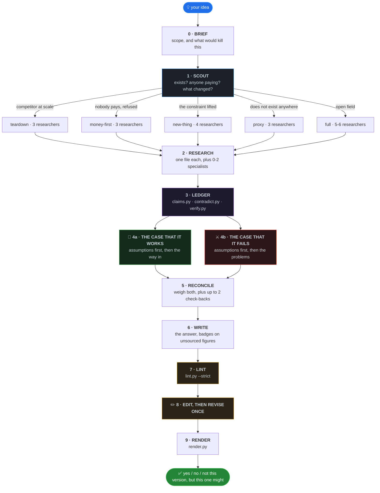

<div align="center">


<br>

**Checks whether a startup idea is worth building.**
**Research agents dig. One agent builds the strongest case that it works and another the strongest case that it fails.**
**A reconciler weighs both, scripts audit every figure, and an editor rejects any sentence a tired founder could not read.**

<br>

[](LICENSE)
[](skills/idea-research/SKILL.md)
[](https://code.claude.com/docs/en/skills)
[](https://agentskills.io)
[](#-the-pipeline)
[](#-the-pipeline)
[](#-the-pipeline)
[](CONTRIBUTING.md)

<br>

[Install](#-install-and-run) · [Pipeline](#-the-pipeline) · [The ledger](#-the-evidence-ledger-three-scripts) · [The linter](#-the-linter) · [The page](#-the-render-layer) · [Files](#-what-a-run-writes) · [Limits](#-limits)

</div>

<br>

<div align="center">
  
  <br>
  <sub><b>A real run.</b> The idea, the companies that already tried it, the money they raised, and what people actually pay for.</sub>
</div>

<br>

## 📦 Install and run

**Claude Code, as a plugin**

```bash
claude plugin marketplace add rishabhrawat35/idea-research
claude plugin install idea-research
```

Restart Claude Code, then run it on an idea:

```
/idea-research an app that helps small Indian gyms manage member payments
```

**Updating**

```bash
claude plugin marketplace update idea-research
claude plugin update idea-research
```

**Claude desktop app, as a skill**

Settings → Capabilities → Skills, then add the skill, or paste in the contents of
[`skills/idea-research/SKILL.md`](skills/idea-research/SKILL.md).

The skill body carries the scripts' commands but not the scripts. If you install by pasting
`SKILL.md` alone, stages 3, 7 and 9 have nothing to run, and the skill says so: a missing script
means running its checks by reading, and saying that is what happened. Clone the repository if you
want the scripts.

**Versions.** [`.claude-plugin/plugin.json`](.claude-plugin/plugin.json) is at `5.0.0` and the
version line at the top of `SKILL.md` reads `5.0.0`. Keep both in step when you fork, because the
desktop app shows only the version printed in the skill body, and a stale line there is the only
number a desktop user ever sees.

**It needs** web search, subagents, and somewhere to write files. No server, no API key, no database.
The three audit scripts, the linter and the renderer are Python 3 standard library only.

<br>

## 🎯 The mistake it is built to avoid

The skill states its own principle as: search asymmetrically, judge symmetrically. Optimism belongs
in how many angles get tried. Neutrality belongs in the conclusion, where a no and a yes need equal
evidence and the same voice.

Getting that backwards produces two errors, and they look identical if you only count today's revenue.

| | Error | What it looks like | What the pipeline does about it |
|:--:|---|---|---|
| ☠️ | **Yes to a corpse** | The idea was put to these people and they refused. Nobody mentions the bodies. | Stage 4b builds the strongest case that it fails, and R2 goes looking for who died and what killed them |
| 🌱 | **No to something new** | Nobody paid to summon a car from a phone before GPS phones existed | Scout asks what changed in the last 24 to 36 months, and stage 5 has to pick refused, not yet possible, or untried |

Telling a refused idea from an untried one is most of the work.

<br>

## 🔄 The pipeline

<div align="center">
  
</div>



The stage table below is the one in `SKILL.md`, with its own agent counts and its own timings.

| Stage | Agents | Time | What happens |
|---|:--:|---|---|
| 0 Brief | 0 | 2 min | Scope, and what would kill this |
| 1 Scout | 1 | 4 min | Exists? Anyone paying? What changed? |
| 2 Research | 3-6 | 9 min | Parallel diggers, one file each |
| 3 Ledger | 0 | 10 sec | Three scripts build the evidence base |
| 4 The pair | 2 | 5 min | Strongest case for, strongest case against |
| 5 Reconcile | 1 | 4 min | Weigh both cases, do the arithmetic |
| 6 Write | 1 | 4 min | The answer |
| 7 Lint | 0 | 5 sec | A script checks the rules, strictly |
| 8 Edit and revise | 2 | 4 min | One rejects the prose, one applies the fixes |
| 9 Render | 0 | 1 min | A page you can share |

**Ten stages, ten to thirteen agents on a typical run, about 33 minutes.** Stage 1 often ends the run
before the expensive part. The longest legal path is seventeen agents: Scout, six researchers, two
specialists, the pair, the reconciler, two check-backs, the writer, the editor, the reviser.

> 💨 **In a hurry?** Ask for quick or triage mode, or compare more than one idea, and it runs stages 0,
> 1, 2, 3, 6 and 7 with three researchers. No pair, no editor, no page, about 19 minutes. The answer
> then takes certainty of evidence from the sourced count and states no strength of view.

<br>

### 🔀 Scout decides how expensive the rest gets

| What Scout finds | What runs | Researchers |
|---|---|:--:|
| 🏢 Direct competitor, funded, at scale, nothing changed | **Teardown**: what they cannot or will not do, whether the money is real | 3 |
| 💸 Nobody pays, and people already refused it | **Money-first**: proof of payment anywhere, and what people pay for instead | 3 |
| 🌱 Nobody pays, but no dead bodies, or what killed them has changed | **New-thing**: earliest adopters, and what it costs to be first | 4 |
| 🌍 The thing does not exist anywhere yet | **Proxy**: the proxy researcher's file leads | 3 |
| 🗺️ Genuinely open field | **Full** | 5-6 |

Search budgets follow the mode: twelve searches each in full, new-thing and proxy mode, eight in
teardown and money-first.

<details>
<summary><b>The proxy researcher</b>, for ideas with no market to measure yet</summary>

<br>

Absence of a product is not evidence of absence of demand. Either nobody can serve the demand
profitably yet, or something worse already meets it. The proxy researcher measures the second, and
writes `lanes/R6_proxy.md` with a section per method, each carrying a number, a date and a source URL,
or the words "no data found for this method".

| Method | What it counts |
|---|---|
| Workaround census | Revealed demand, priced by the upkeep people already pay for spreadsheets, templates, scripts and hand-run WhatsApp groups |
| Complaint cluster mining | Unserved demand with its failure mode attached, clustered by complaint rather than by product |
| Substitute time-on-task | Hours already spent on the substitute, taken from a published study or a vendor case study, never timed by the agent |
| Search-trend slope | Intent before any transaction exists, read as slope and turning points, never absolute volume |
| Second-hand listing counts | An installed base before any brand reports one, from OLX, Cashify and Facebook Marketplace |
| Foreign analogue | A leading indicator from the country where this is already normal, plus who did it by hand there before it was |

It takes R5's slot, because funding follows demand and there is no deal history to trace.

</details>

<details>
<summary><b>The five research lanes, and the specialists</b></summary>

<br>

Each researcher gets an identity line and four fields, because identity alone does not improve
reasoning and the procedure does.

| ID | Identity line | Objective | Boundary |
|---|---|---|---|
| R1 | Sold to Indian consumers with no money | Who pays, how much, how often, which group pays best | Money, not competitor strategy |
| R2 | Knows which companies here died and why | Who is doing it, who failed, what killed them, whether that cause still applies | Company history, not customers |
| R3 | Reads the forums | Where these people talk in their own words, and who already hacks a workaround | Behaviour, not market size |
| R4 | Grew a product on ₹0 | The first 100 users named, how to reach them free, what blocks trust | Distribution, not pricing |
| R5 | Tracks Indian seed deals | Who funds this, what makes them decline, whether it works unfunded | Funding, not operations |

Nought to two specialists join by domain: NMC, CDSCO and ABDM rules for health; RBI, IRDAI, SEBI and
DPDP for fintech; customs, BIS and landed cost for hardware; the coach, teacher or farmer doing the
job today for sports, education and agri; the procurement head who signs for B2B; a community
moderator who knows platform risk for consumer social and creator tools. The cap is two, because
needing more means the idea is scoped too wide.

</details>

<details>
<summary><b>Blocked sources are not an excuse</b>, and the file has to say which rungs it tried</summary>

<br>

"Reddit was blocked" is a researcher giving up. There is a ladder, and a file that stops at a block
goes back once.

1. Search for the content instead of the page, because threads get quoted in search results. Try `site:reddit.com <topic>`.
2. A different community on the same subject: forums, app store reviews, YouTube comments, Trustpilot.
3. The same question about another country, which often beats the local answer and feeds the "what changed" test.
4. Someone who already did the reading: market reports, journalism, dissertations.
5. The browser tools, if the session has them.

Only then "could not find out", listing the rungs tried. Finding nothing that argues against the idea
is treated as not having looked.

</details>

<br>

## 🧾 The evidence ledger, three scripts

Stage 3 used to be an agent writing an evidence ledger by hand. It is now three scripts in
[`skills/idea-research/tools/`](skills/idea-research/tools), run in order, and no agent writes the
ledger any more.

```bash
python3 <skill folder>/tools/claims.py     runs/<slug>/            # claims.jsonl + claims_summary.md
python3 <skill folder>/tools/contradict.py runs/<slug>/            # contradictions.md
python3 <skill folder>/tools/verify.py     runs/<slug>/ --sample 8 # verify_queue.md + verify.json
```

Real output, from running all three over a real run directory. Runs are gitignored, so this one is not
in the repository:

```
$ python3 tools/claims.py runs/ttc-planner/
395 claims from 11 files -> runs/ttc-planner/claims.jsonl
sourced 53, guess 37, unsourced 305

$ python3 tools/contradict.py runs/ttc-planner/
3 contradiction pair(s) across 395 claims -> runs/ttc-planner/contradictions.md
  [assertion] Dingxiang Mama (knowledg, sell): 03_build.md:17 vs lanes/R3_demand.md:13
  [figure] Healofy (funding): 01_scout.md:13 vs 01_scout.md:35
  [figure] India's (revenue): 04_panel.md:13 vs lanes/R3_demand.md:51

$ python3 tools/verify.py runs/ttc-planner/ --sample 8
sampled 8 of 53 sourced claims (395 claims in all) -> runs/ttc-planner/verify_queue.md
```

Of the 395 claims that run produced, 53 carried a source. The reconciler has to put that ratio in the
answer as one line, X of Y claims sourced, and the writer has to check it before leaning on any
figure and badge the unsourced ones.

| Script | Lines | What it does | What it will not do |
|---|:--:|---|---|
| [`claims.py`](skills/idea-research/tools/claims.py) | 244 | Pulls every factual claim out of the run's research files, records the figure on the line and whether a source sits behind it, and writes `claims.jsonl` plus `claims_summary.md`. It skips the files the pipeline generates itself, so it never reads its own output. Nothing is hardcoded, so a renamed or added stage file is audited without editing the script. | Judge whether a sourced claim is true |
| [`contradict.py`](skills/idea-research/tools/contradict.py) | 588 | Reads `claims.jsonl` and flags three cases only: one entity carrying two different figures of the same kind, one entity with two different years on the same event, and one line asserting what another negates. Writes `contradictions.md`. | Find every disagreement. Its own help says precision beats recall, because a checker that cries wolf gets switched off |
| [`verify.py`](skills/idea-research/tools/verify.py) | 158 | Samples the claims that carry a URL into `verify_queue.md`, a numbered worklist with three boxes per claim (SUPPORTED, NOT SUPPORTED, COULD NOT FETCH), and the same sample as data in `verify.json`. `--seed` reproduces a sample. | Fetch anything. Its own help says so in those words |

A contradiction touching a number the answer depends on goes to a check-back agent at stage 5. The
verify queue has an owner too: the check-back agent works the rows that carry weight and writes what
it found into `05c_checkback.md`. `SKILL.md` gives the reason for sampling at all, which is that
published audits find only about half of cited statements fully supported by the source cited.

<br>

## 🧪 The linter

[`skills/idea-research/lint.py`](skills/idea-research/lint.py) is 371 lines, standard library only,
and runs in seconds. There is one copy and that is its path.

```bash
python3 <skill folder>/lint.py runs/<slug>/ANSWER.md --strict   # add --json for machine-readable counts
```

```
usage: lint.py [-h] [--strict] [--json] path

Lint an idea-research answer.

positional arguments:
  path

options:
  -h, --help  show this help message and exit
  --strict    exit 1 when any problem is found
  --json      emit results as JSON
```

`--strict` exits 1 on any problem, so a run does not ship while it fails. The default is advisory and
exits 0.

<div align="center">
  
</div>

<br>

**A clean answer**, a fully tagged one written against these rules:

```
$ python3 lint.py test/ANSWER.md
test/ANSWER.md: clean - 0 problems (1553 visible words, 18 block tags)
```

**A failing answer**, a real run written before these rules existed. Thirty-six problems, and the tail
of the real output:

```
$ python3 lint.py ANSWER.md
...
ANSWER.md:144: HEADING: heading names a topic, not a finding: If the numbers are wrong
ANSWER.md:151: REPEAT: sentence is near-identical to line 66: Median revenue per install at day 60 is $0.06 to $0.09 for I...
ANSWER.md:155: LONG: sentence is 36 words (max 25): A ratio above five to one between what a customer is worth a...
ANSWER.md:159: BUDGET: section is 754 words (budget 250): The way in
ANSWER.md:184: LONG: sentence is 28 words (max 25): An AMH test runs ₹1,499 to ₹2,875 depending on the lab, per ...
ANSWER.md:426: QUOTE: quotation marks with no source link - nobody was interviewed

36 problems: BUDGET 7, HEADING 13, LONG 4, QUOTE 2, REPEAT 2, TOTAL 1, UNSOURCED 7
5737 visible words, 0 block tags
```

The last two lines carry the two facts a run needs before it ships. That answer is 5,737 visible words
against a ceiling of 2,000, and it has no block tags, so the renderer would output it as plain prose.

### The fourteen checks

| Check | What trips it |
|---|---|
| `TOTAL` | The whole answer is over 2,000 visible words, appendices excluded |
| `BUDGET` | A section is over its word budget: 350 for Part 1, 800 each for Parts 2 and 3, 250 for any other section. Appendices are uncapped |
| `LONG` | A sentence over 25 words |
| `PARA` | A paragraph over three sentences |
| `FRAGMENT` | A sentence of 4 to 18 words with no finite verb, checked against an explicit verb list rather than guessed from suffixes |
| `CELL` | A table cell over 15 words |
| `HEDGE` | A table cell that is only a hedge |
| `HEADING` | A heading under four words, or one that names a topic rather than stating a finding |
| `UNSOURCED` | A figure with no URL, no source line, no "we are guessing" and no honest badge anywhere near it |
| `BANNED` | A word from the never-write table in `SKILL.md`, plus the generic slop that table exists to stop |
| `JARGON` | `pass`, `burn`, `traction`, `TAM`, `SAM`, `wedge`, `GTM`, `ARR`, `CAC`, `LTV`, each with the phrase it should have been |
| `INTERNAL` | The system's own vocabulary reaching the founder |
| `QUOTE` | Quotation marks around five or more words with no source link, because nobody was interviewed |
| `REPEAT` | A sentence repeated word for word, or a sentence over twelve words that is 0.90 similar to another |

It knows which section it is in. Imperatives and budget figures are right in an action list and wrong
in an analysis, so Part 3 and the action sections lose the `PARA`, `FRAGMENT`, `UNSOURCED` and
`QUOTE` checks and keep the rest. A number the writer honestly marked `[[warn:Thin]]` or `[[bad:Not found]]` does not
trip `UNSOURCED`, because that marking is what the skill asked for.

<details>
<summary><b>Then an editor who never saw the research</b></summary>

<br>

Stage 8 reads `ANSWER.md` and the lint output, and nothing else. It can do exactly three things, and
inventing a fact is not one of them.

| | |
|---|---|
| 🔁 **FIX** | A replacement built only from words already on the page |
| ✂️ **CUT** | Delete the line |
| ❓ **NEEDS A FACT** | Name the missing fact. It may not supply it. |

A second agent applies the swaps. For a `NEEDS A FACT` line it looks in the research files: if the
fact is there it writes the line and cites the source, and if it is not, the line gets marked rather
than deleted. A line proposing an action keeps its words and moves into Appendix C, saying what was
proposed and what is missing behind it. A line stating a finding keeps its place and carries
`[[bad:Not found]]`. Deletion is only for a line asserting a figure as fact with no source anywhere.

Then the lint runs again, one round only, because two agents editing each other never converge. If
`--strict` still fails, the run says so in chat instead of shipping quietly.

</details>

<details>
<summary><b>Who is allowed to state a new fact</b></summary>

<br>

| Agent | Can add facts? | What stops it |
|---|:--:|---|
| Scout | ✅ twelve searches | Its findings go into later prompts marked provisional, and researchers must correct them |
| Researchers | ✅ eight or twelve searches | Every fact gets a source URL, or the words "no source, this is a guess" |
| 4a, the case that it works | ✅ max 5 searches | Assumptions written first, each marked sourced or assumed |
| 4b, the case that it fails | ✅ max 5 searches | Assumptions written first, each marked sourced or assumed |
| Check-back | ✅ max 5 searches | Writes the question, the answer and the source URL, and never more than two of these agents run |
| Reconciler | ❌ zero searches | Where a number it needs is missing it writes "not found in the research", never an estimate |
| Writer | ❌ zero searches | *"YOU MAY NOT STATE ANY FACT THAT IS NOT IN THOSE FILES"* |
| Editor | ❌ zero searches | Replacements built only from words already on the page |
| Reviser | ❌ zero searches | Adds no number, name, date, price or claim not already in the answer or a research file |

</details>

<br>

## 🖼️ The render layer

The writer tags blocks in the markdown as HTML comments on their own line, so the file stays valid
markdown anywhere else, and [`render/render.py`](skills/idea-research/render/render.py), 780 lines,
binds each tag to a component.

```bash
python3 <skill folder>/render/render.py runs/<slug>/ANSWER.md
```

Real output, on that same fully tagged answer:

```
$ python3 render/render.py test/ANSWER.md
wrote test/report.html (33839 bytes)
tags found: cards x1, caution x1, compare x1, finding x6, important x1, meta x1, note x1, quote x1, stat x1, steps x1, tip x1, verdict x1, warn x1
```

That is one self-contained file with [`report.css`](skills/idea-research/render/report.css), 398
lines, inlined, and no JavaScript. The script prefers the third-party `markdown` package if it is
installed and falls back to a built-in converter if it is not, so it runs on a laptop with nothing
installed. Zero tags reported means the writer skipped the tagging instruction, and `ANSWER.md` goes
back once; if it returns untagged the run ships it as plain prose and says so.

<details>
<summary><b>The fifteen block tags</b>, from <a href="skills/idea-research/render/COMPONENTS.md">render/COMPONENTS.md</a></summary>

<br>

A tag applies to the block that follows it. Text after a pipe becomes the label, title or attribution:
`<!--::warn|Do not do this-->`. Untagged content renders as prose, so only what earns a component is
tagged.

| Tag | What it holds |
|---|---|
| `::meta` | Date, status, owner. One block, `Key: value` per line, above the H1 |
| `::verdict` | The single call. Used once, the largest thing on the page |
| `::stat` | Numbers that each carry an argument, as `value :: label` |
| `::finding` | One claim plus its evidence, cost strip and next step |
| `::note` | Neutral context the reader needs but would not act on |
| `::tip` | A practical shortcut |
| `::important` | The one belief everything rests on |
| `::warn` | A cost, a limit, a thing that will bite |
| `::caution` | A legal, ethical or safety line |
| `::compare` | Options scored on shared axes, with the winning row's first cell in bold |
| `::quote` | A cited voice, attribution after the pipe |
| `::steps` | A numbered sequence |
| `::cards` | What to read or run next, as `name :: one line` |
| `::figure` | A figure with a title and a `Source:` line last |
| `::appendix` | Sources and raw rows, collapsed closed |

Section numbers come from CSS counters, so the writer does not type them. An italic line directly
under a heading becomes that section's subtitle. Any `## Appendix ...` heading collapses into a closed
`<details>` whether or not it is tagged. Every table gets a phone card collapse and per-cell labels
automatically. Inline badges are `[[ok:Sourced]]`, `[[warn:Thin]]`, `[[bad:Not found]]` and
`[[flat:Carried]]`.

</details>

<br>

## ⚖️ What the answer says, and how sure it is

The call is one sentence: yes, no, or "not this version, but this one might". It appears in exactly one
place, Part 1, and Parts 2 and 3 may not restate it.

Two rating fields travel with it, as separate sentences, never blended into one.

| Field | Values |
|---|---|
| **Certainty of evidence** | High (very confident the truth is close to what the research found), Moderate (likely close, could be substantially different), Low (confidence limited), Very low (very little confidence) |
| **Strength of view** | "we recommend" for a strong view, "we suggest" for a weak one |

A strong view resting on Low certainty is allowed, as long as it is visible. `SKILL.md` gives the
reason for keeping the two apart: a blend hides whether the doubt sits in the evidence or in the view.

Before either field is written, stage 5 has to pick one of three states and cite both case files for
it. **Refused** means people met this and said no. **Not yet possible** means a named constraint
blocked it, and the reconciler says whether that constraint has lifted. **Untried** means nobody put
it to these people, which is evidence for neither side.

Two more rules govern the ending. If people have already refused this, the answer says "don't build
this" plainly and does not soften it. If people are paying and the constraint that blocked this has
lifted, it says "build this" plainly and does not soften that either. It never ends on a no with no
way in: if none was found, it says so and says what would change.

<details>
<summary><b>The writing rules every agent inherits</b></summary>

<br>

Every agent prompt points at this section instead of restating it, so there is one copy of the rules.

| Never write | Write instead |
|---|---|
| artefact, offering, solution, proposition, keepable | the PDF, the app, the thing |
| actionable, learnings, surface | say what it actually is |
| load-bearing, resolves to, converts into | rests on, is really, becomes |
| leverage (as a verb), unlock, enable | use, let, allow |
| ecosystem, landscape, moat, thesis, posture | name the actual thing |
| pass, burn, traction, TAM, wedge, GTM | "an investor would decline, because…" |
| "Buy the traffic", "the killer assumption" | "Run Meta ads, ₹12,000", "what has to be true" |

The system's own vocabulary never reaches the founder either. No stage name, no rating label, no mode
name. Twelve numbered rules sit under that table: complete sentences always, nothing over 25 words,
three sentences per paragraph, table cells to 15 words, no aphorisms, no invented quotes, numbers
instead of adjectives, say where a fact came from, state the mechanism rather than the conclusion, one
fact has one owning section, and headings that state the finding rather than the topic. The linter
enforces the ones a script can check. The editor at stage 8 judges the rest.

</details>

<details>
<summary><b>Why the loop cannot run away</b></summary>

<br>

It is a straight line. No stage's output can re-trigger an earlier one.

| Repeat point | Cap |
|---|:--:|
| Researchers | 6 |
| Specialists | 2 |
| Check-back agents | 2 |
| Edit rounds | 1, and a second lint failure reports to you rather than looping |
| Longest legal path | 17 agents |

That path is Scout, six researchers, two specialists, the two case agents, the reconciler, two
check-backs, the writer, the editor and the reviser.

</details>

<br>

## 📁 What a run writes

Everything lands in `runs/<slug>/`, and the run directory is the state. Agents write files and return
five lines, so the chat does not fill up and the run does not forget the question.

```
runs/<slug>/
├── 00_brief.md          read by every agent: scope, and what would kill this
├── 01_scout.md          does it exist, does anyone pay, what changed
├── _findings.md         the running list, and every correction to Scout
├── lanes/               one file per researcher
├── claims.jsonl         every claim as data, read by contradict.py and verify.py
├── claims_summary.md    sourced against guessed, one row per claim
├── contradictions.md    where two sources disagree
├── verify_queue.md      the check-back's rows, three boxes each
├── verify.json          the same sample as data, so a later run can compare
├── 04a_case_for.md      the case that this works
├── 04b_case_against.md  the case that it fails
├── 05_reconcile.md      both cases weighed, plus the two rating fields
├── 05c_checkback.md     looked-up facts, and which of them were called decisive
├── 06_edit.md           what the editor sent back
├── ANSWER.md            what the founder reads
└── report.html          the same thing as a page
```

Runs are kept, and `runs/` is gitignored, so the same idea reshaped a month later can be run again and
the two directories compared side by side.

<details>
<summary><b>What is in ANSWER.md</b></summary>

<br>

About 1,800 visible words across three parts, plus four appendices that open closed.

| Part | Words | What is in it |
|---|:--:|---|
| **Part 1. The answer** | ~300 | The call, the number that drives it, certainty of evidence and strength of view as separate sentences, the one condition that would change the answer, and the one thing to do today. Nothing else. |
| **Part 2. What the evidence shows** | ~700 | Findings only, no recommending. Whether people refused this, could not have done it until now, or never tried it. Who has already tried and where they ended up. What this market pays for today in ₹. What the proxy measures found. Where the two cases disagreed. What breaks if the numbers are wrong. |
| **Part 3. What to do** | ~800 | The cheapest version that could exist by Friday, or one line saying no way in was found and what would have to change. A test under ₹20,000 and two weeks, the last step naming the number that means yes and the number that means no. The people to ask, named specifically enough to find this week. The next 90 days in three horizons. |
| **Appendix A** | uncapped | Sources and calculations for every figure, from `claims_summary.md` unchanged, plus the sourced-against-guessed count |
| **Appendix B** | uncapped | Where two sources disagree, from `contradictions.md`. If empty, it says the script found no numeric conflict |
| **Appendix C** | uncapped | What could not be found out: the question, why it matters, and the cheapest way to answer it |
| **Appendix D** | uncapped | How this looks from each side, and both cases in full |

A number in Part 3 is a target the founder is setting, not a finding, and the answer says that once
rather than badging it. Nothing a reader needs in order to act may sit inside an appendix, and no
section is ever silently dropped: running out of room means cutting detail, never a whole section.

</details>

<br>

## ⚠️ Limits

Read these before you trust an answer.

**It interviews nobody.** Every run is desk research. That is why quotation marks need a real person,
a real source and a link, why the linter has a `QUOTE` check, and why "would you pay for this" is
never the question the answer tells you to ask.

**The verify queue cannot verify anything.** `verify.py` samples cited claims and builds the worklist.
Its own help says it cannot fetch anything: an agent or a person has to open each URL and tick a box.
An unworked queue is a queue, not a check.

**The contradiction detector misses more than it catches.** It handles three cases and nothing else,
and it would rather miss a disagreement than invent one. On the run quoted above it flagged 3 pairs
out of 395 claims. A quiet `contradictions.md` means no numeric conflict of those three kinds was
found, not that the research agrees with itself.

**Most claims arrive unsourced.** On that same run, `claims.py` counted 53 sourced, 37 marked as a
guess and 305 unsourced out of 395. `SKILL.md` records another run at 154 of 222 claims with no
source. That is exactly why the writer is told to check `claims_summary.md` before leaning on a figure
and to badge any unsourced number, and why the certainty field exists at all.

**The linter checks form, not truth.** A clean lint means the prose obeys the rules. It says nothing
about whether a sourced figure is correct, or whether the source says what the line claims.

**India is the default,** and ₹ is the currency. Ideas for other markets work, but the named sources,
the regulators and the price expectations in stage 2 are Indian, so change the brief and the lanes if
you point it elsewhere.

<br>

## 🧩 What changed in 5.0

This was a pipeline change, not a wording pass, so both version numbers went to `5.0.0`.

| Change | Why |
|---|---|
| The evidence ledger became three scripts | An agent was writing it by hand. `claims.py`, `contradict.py` and `verify.py` now build it at stage 3, in about ten seconds |
| The conclusion moved to stage 5 | The case-against agent had been asked to pick refused or not yet possible, which made it the author of the conclusion. Both case agents now carry the same no-vote clause |
| A third state, untried | The pick had two options and no way to say nobody has ever put this to these people, which is evidence for neither side |
| Two rating fields instead of one | Certainty of evidence and strength of view are stated separately, because a blend hides where the doubt sits |
| The check-back file got a name | `05c_checkback.md` is now in the writer's read list, so the rule that a decisive check-back fact re-opens the conclusion can actually fire. One earlier run found the deciding fact in a check-back and shipped the opposite conclusion |
| `_findings.md` reaches the later stages | It is the home for every correction to Scout, and it was read by no stage after 2. In one run a corrected claim failed to propagate and three wrong sentences reached the last hop |
| Stage 8 marks instead of deleting | The default was deletion, which stripped the way in and could not strip the case against. Now an unsupported action line moves to Appendix C with its words intact |
| Block tags and a renderer | The writer tags blocks, `render.py` binds them to components, and the output is one self-contained HTML file |
| Forced counts removed | A quota for named people, assumptions and seats made agents invent them. `SKILL.md` records that a forced count raised fabricated citations by 7 to 11 points |
| `lint.py --strict` can pass | Its section budget was 250 words against a mandated 300, 700 and 700, so no compliant answer could pass. Budgets are now 350, 800 and 800, it recognises `PART n.` headings, and it accepts `[[warn:` and `[[bad:` as honest marking |
| Every command runs as pasted | The script paths and the run paths were both relative, and no working directory satisfied both. All five commands now carry a `<skill folder>/` prefix |
| `claims.py` audits the case files | Its file list still named the old stage filenames, so `04a` and `04b` were never read. Nothing is hardcoded now |
| `render.py` runs with nothing installed | It imported `markdown` with no fallback. A built-in converter now stands in |

<br>

## 🛠️ When it goes wrong

| What you see | Why | Fix |
|---|---|---|
| Every idea comes back as no | Scout never asked what changed, or 4a was skipped | Rerun 4a, check Scout answered question 4 |
| The answer reads like slogans | Stage 8 was skipped | Run stages 7 and 8 |
| A check-back fact never reached the answer | The revisable-verdict rule was ignored | Rerun stage 6 with that fact at the top |
| Numbers in the answer with no source | `claims_summary.md` was not read | Rerun stage 6 and require the badges |
| A file says a source was blocked and stops | The ladder was ignored | Send it back once, naming the rungs |
| No Indian sources anywhere | The brief named no place | Put the city or state in the brief, rerun stage 2 |
| Lint reports `BUDGET` or `TOTAL` | Part 3 took nine items in 700 words | Editor check 6 names the cuts, revise once |
| `render.py` reports zero tags | The writer skipped the tagging instruction | Send `ANSWER.md` back once, then ship as prose |

<br>

## 🎛️ Make it yours

The engine is one file: [`skills/idea-research/SKILL.md`](skills/idea-research/SKILL.md), 475 lines of
plain English, not code. The scripts beside it are the parts a script does better than a prompt.

Change the default market from India, add a specialist for your domain, extend the never-write table,
move the ₹20,000 test budget, add a research lane. Then bump the version line in `SKILL.md` and in
[`.claude-plugin/plugin.json`](.claude-plugin/plugin.json), fork, and install your copy:

```bash
claude plugin uninstall idea-research
claude plugin marketplace remove idea-research
claude plugin marketplace add <your-username>/idea-research
claude plugin install idea-research
```

The linter's banned list is deliberately editable in two halves. The first half is the never-write
table in `SKILL.md`, verbatim. The second half is generic slop kept on judgement, and `lint.py` says
which line to delete to make the list the table and nothing else.

<br>

## 🤝 Contributing

PRs welcome, ranked by how much they would help.

| | |
|---|---|
| 🥇 **A run that got it wrong** | The idea, the answer it gave, and what actually happened. The most useful thing you can file |
| 🥈 **A specialist for a new domain** | Legal, logistics, gaming, climate, real estate |
| 🥉 **A market other than India** | The defaults live in stage 0 and stage 2 |
| 🔬 **A fourth contradiction case** | `contradict.py` handles three, and it misses more than it catches |
| 📝 **Words for the never-write table** | If a sentence sounded like a consultant, say which one gave it away |

See [CONTRIBUTING.md](CONTRIBUTING.md).

<br>

## 📜 Licence

MIT. See [LICENSE](LICENSE).

<div align="center">
<br>
<sub>Built because the answer to "should I build this?" is usually no, and the useful part is <i>why</i>.</sub>
</div>
