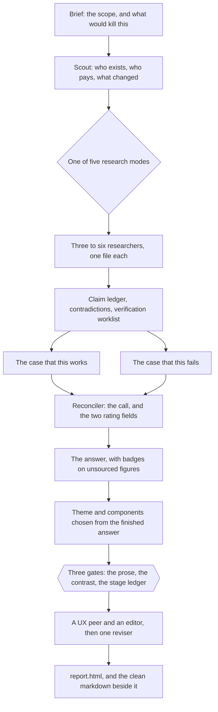

# idea-research

*Checks whether a startup idea is worth building, and leaves the evidence behind the answer on disk.*

**Two agents argue the same research to opposite conclusions, a reconciler weighs them, eight scripts build the evidence ledger and gate the run, and you get one page to send on.**

[](LICENSE)
[](skills/idea-research/SKILL.md)
[](https://code.claude.com/docs/en/skills)
[](#prerequisites)

## What it does, and the first command

You describe an idea in one sentence. Research agents find who sells it in India, who pays, who died trying and what changed recently. One agent argues that it works, another that it fails, from the same files, and a reconciler picks the call: build this, do not build this, or not this version.

```bash
claude plugin marketplace add rishabhrawat35/idea-research
claude plugin install idea-research
```

The plugin loads after a restart, and one sentence names the idea:

```
/idea-research an app that helps small Indian gyms manage member payments
```


## What you get

- **The answer gives one call and rates it twice.** It says yes, no or "not this version", then rates the evidence and the view in two separate sentences.
- **Every figure carries its status.** `claims.py` marks each claim sourced, guessed or unsourced, and the writer badges the shaky numbers.
- **No run ships on an agent's word.** Three scripts gate it, and a stage that wrote no file is reported as a gap.
- **The page is one HTML file, with no JavaScript.** `render.py` inlines the stylesheet, so you can mail the page or paste it into a chat.
- **Nineteen checks run before the answer ships, two of them advisory.** `lint.py` rejects sentences over 25 words, consultant vocabulary, unsourced quotations and figures with no source.
- **The working stays on disk.** One directory per run holds the brief, each researcher's file, both cases, the ledger and the page.

## How a run works



What a run costs:

- **Scout sets the price of the rest.** A funded competitor gets three researchers, an open field up to six.
- **A typical run spends thirteen to sixteen agents.** The longest legal path spends twenty.
- **One measured run took 83 minutes.** [SKILL.md](skills/idea-research/SKILL.md) names the six measured stages.
- **Quick mode spends three researchers.** It drops the two cases, the reconciler, the design pass and the judges, and renders on the default theme.

## What each script gives you

| Script | What it gives you | What it writes |
|---|---|---|
| [`tools/claims.py`](skills/idea-research/tools/claims.py) | Counts the claims that carried a source, and lists the shaky ones that carry a figure | `claims.jsonl`, `claims_summary.md`, `claims_brief.md` |
| [`tools/contradict.py`](skills/idea-research/tools/contradict.py) | Pairs the lines that disagree on a figure, a year or an assertion | `contradictions.md` |
| [`tools/verify.py`](skills/idea-research/tools/verify.py) | Numbers a worklist for opening cited URLs, and takes `--sample` and `--seed` to size and repeat it | `verify_queue.md`, `verify.json` |
| [`tools/run_state.py`](skills/idea-research/tools/run_state.py) | Prints one row per stage and names the first stage whose output is missing; `check --strict` exits 1 on a gap | `_state.json`, `_state.md` |
| [`lint.py`](skills/idea-research/lint.py) | Applies nineteen writing and composition checks; `--strict` exits 1, `--json` puts the counts on disk | `lint.json`, when you redirect it |
| [`tools/theme_check.py`](skills/idea-research/tools/theme_check.py) | Measures ten contrast ratios for the page's palette against the 4.5:1 floor for body text | Nothing; the exit code is the result |
| [`render/render.py`](skills/idea-research/render/render.py) | Builds the page, and the markdown with every tag and badge stripped, which is the file a person is handed. It inlines [`report.css`](skills/idea-research/render/report.css) and one palette from [`themes.py`](skills/idea-research/render/themes.py) | `report.html`, `ANSWER_clean.md` |


[render/COMPONENTS.md](skills/idea-research/render/COMPONENTS.md) documents the eighteen block tags, the four themes and the inline badges.

## Prerequisites

| Requirement | Why it is needed |
|---|---|
| Claude Code, or the Claude desktop app with skills | Every stage is an agent, and something has to spawn them |
| Web search and subagents in the session | Researchers go out in parallel and each returns a file |
| Somewhere to write files | The run directory is the state, and agents read each other through it |
| Python 3 | Seven of the eight scripts import the standard library only, and the renderer falls back to a built-in converter when the `markdown` package is absent |

It needs no API key, no server and no database.

## Installation

### Claude Code, as a plugin

Those two commands print this:

```
Adding marketplace…Cloning via HTTPS: https://github.com/rishabhrawat35/idea-research.git
Refreshing marketplace cache (timeout: 120s)…
Cloning repository (timeout: 120s): https://github.com/rishabhrawat35/idea-research.git
Clone complete, validating marketplace…
Cleaning up old marketplace cache…
√ Successfully added marketplace: idea-research (declared in user settings)
Installing plugin "idea-research"...√ Successfully installed plugin: idea-research@idea-research (scope: user)
```

Update with `claude plugin marketplace update idea-research`, then `claude plugin update idea-research`.

### Claude desktop app, as a skill

Add it as a skill in the desktop app, or paste in [`skills/idea-research/SKILL.md`](skills/idea-research/SKILL.md). That file carries the scripts' commands but not the scripts, so a pasted install has nothing to run for the ledger and the three gates. Clone the repository for the scripts.

## Quickstart

1. Install the plugin with the two commands above, then restart Claude Code.
2. Ask about one idea: `/idea-research an app that helps small Indian gyms manage member payments`.
3. Answer up to three scoping questions, then wait.
4. Check the prose gate on the answer, from a clone. The run directory takes the idea's name, and `runs/` is ignored by git:

```bash
python3 skills/idea-research/lint.py runs/conceive-planner/ANSWER.md --strict
```

```
runs/conceive-planner/ANSWER.md: clean - 0 problems (1599 visible words (no cap; advisory fallback 2000), 0 sections over their advisory fallback, 25 block tags)
```

5. Check that no stage was skipped. One row, the check-back, is optional:

```bash
python3 skills/idea-research/tools/run_state.py check runs/conceive-planner/ --strict
```

```
... nine earlier rows, one per stage ...
  10  lint       lint.json                                                               present  lint --strict exit 0
  11  edit       06_edit.md, 07_ux.md                                                    present  (output on disk, never recorded)
  12  render     report.html, ANSWER_clean.md                                            present  report.html and ANSWER_clean.md rebuilt after the UX pass

OK. 11 of 11 required stages have their output.
```

6. Rebuild the page after any edit, on the `theme.json` the design pass wrote:

```bash
python3 skills/idea-research/render/render.py runs/conceive-planner/ANSWER.md --theme runs/conceive-planner/theme.json
```

```
theme: warm (light ground), accent #7d3550, density regular
fonts: Inter, Newsreader
wrote runs/conceive-planner/report.html (55837 bytes)
wrote runs/conceive-planner/ANSWER_clean.md (23785 bytes)
tags found: appendix x4, asks x1, caution x1, compare x1, finding x5, important x2, meta x1, note x2, quote x1, ranked x1, stat x1, steps x1, timeline x1, tip x1, verdict x1, warn x1
```

7. Send `report.html` and `ANSWER_clean.md` to whoever decides, not `ANSWER.md`, which carries tag comments the renderer strips.

## Troubleshooting

| What you see | Why | What to do |
|---|---|---|
| `render: --theme runs/conceive-planner/theme.jsn does not exist, so no theme was validated` | The theme path was mistyped, and nothing was written | Fix the path, or drop `--theme` to render on the default palette |
| `run_state: stage research (research lanes) has no _findings.md, lanes/ in the run directory` | That stage never wrote the file it owes | Run the stage again, or say in chat that the run shipped without it |
| `render.py` reports zero tags, and the page reads as paragraph after paragraph | The design pass was skipped, or it applied no components | Run the design pass once more, then render again |
| Every idea comes back as no | Scout never asked what changed, or the case for the idea was never built | Rerun both, and check Scout answered the "what changed" question |
| Numbers in the answer with no source | The shaky-claims brief was not read before writing | Ask for the answer to be written again with the badges required |
| No Indian sources anywhere | The brief named no place | Put the city or state in the brief, then rerun the research |

## Limits

- **It interviews nobody.** Every run is desk research, so a quotation with no link fails the lint, and nobody is asked whether they would pay.
- **Most claims arrive with no source.** Across one run's eight research files, `claims.py` counted 303 claims and 108 with a source, which is why the badges exist. The same script on the finished run counts 619 and 116, because the later files restate.
- **The contradiction check misses more than it catches.** It covers three narrow cases and flagged eight pairs across those 303 claims, so a quiet report proves little.
- **The worklist verifies nothing by itself.** `verify.py` samples cited claims into a list, and a person still opens each URL.
- **The linter checks form, not truth.** A clean run means the prose obeys the rules, not that a figure is right.
- **India is the default and the rupee is the currency.** Other markets need a changed brief, because the regulators and price anchors in the prompts are Indian.
- **It refuses four neighbouring jobs.** It is not a pitch deck, a financial model, a market-size lookup or a review of a company that already exists.

## Status

Working, at version 6.1.1 in both [`plugin.json`](.claude-plugin/plugin.json) and [SKILL.md](skills/idea-research/SKILL.md), checked on 11 September 2026 by installing the plugin and running the three gates.

## Contributing

The engine is one file of plain English, [`skills/idea-research/SKILL.md`](skills/idea-research/SKILL.md), so changing how a run thinks means editing prose, not code. There is no test suite: run the skill on ideas whose answer you know, and name them in the pull request. [CONTRIBUTING.md](CONTRIBUTING.md) ranks the rest, and a run that got it wrong is the most useful thing to file.

## License

MIT. See [LICENSE](LICENSE).
