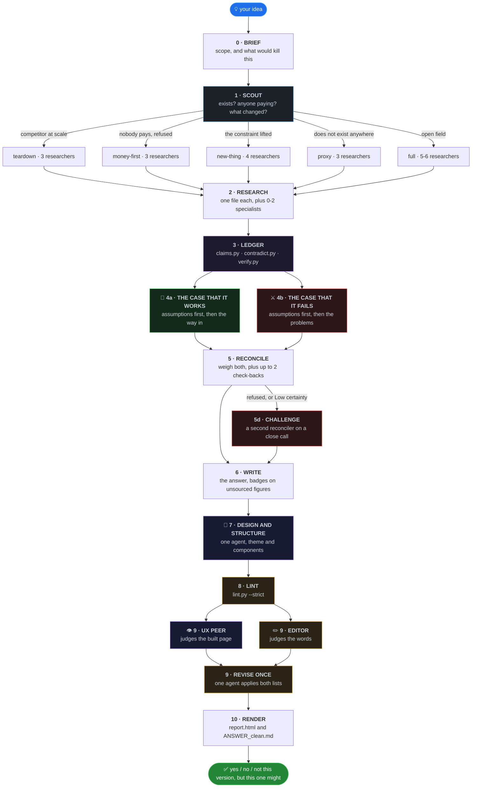

<div align="center">


<br>

**Checks whether a startup idea is worth building.**
**Research agents dig. One agent builds the strongest case that it works and another the strongest case that it fails.**
**A reconciler weighs both, scripts audit every figure, a design agent builds the page from the answer, and three gates have to pass before anything ships.**

<br>

[](LICENSE)
[](skills/idea-research/SKILL.md)
[](https://code.claude.com/docs/en/skills)
[](https://agentskills.io)
[](#-design-and-structure)
[](#-three-gates-before-a-run-ships)
[](#the-nineteen-checks)
[](CONTRIBUTING.md)

<br>

[Install](#-install-and-run) · [Pipeline](#-the-pipeline) · [The ledger](#-the-evidence-ledger-three-scripts) · [Design](#-design-and-structure) · [The linter](#-the-linter) · [The page](#-the-render-layer) · [Files](#-what-a-run-writes) · [Limits](#-limits)

</div>

<br>

## 📦 Install and run

**Claude Code, as a plugin**

```bash
claude plugin marketplace add rishabhrawat35/idea-research
claude plugin install idea-research
```

Restart Claude Code, then run it on an idea:

```
/idea-research an app that helps small Indian gyms manage member payments
```

**Updating**

```bash
claude plugin marketplace update idea-research
claude plugin update idea-research
```

**Claude desktop app, as a skill**

Settings → Capabilities → Skills, then add the skill, or paste in the contents of
[`skills/idea-research/SKILL.md`](skills/idea-research/SKILL.md).

The skill body carries the scripts' commands but not the scripts. If you install by pasting
`SKILL.md` alone, stages 3, 7, 8 and 10 have nothing to run and no stage can record itself, and the
skill says so: a missing script means running its checks by reading, and saying that is what
happened. Clone the repository if you want the scripts.

**Versions.** [`.claude-plugin/plugin.json`](.claude-plugin/plugin.json) is at `6.1.0` and the
version line at the top of `SKILL.md` reads `6.1.0`. Keep both in step when you fork, because the
desktop app shows only the version printed in the skill body, and a stale line there is the only
number a desktop user ever sees.

**It needs** web search, subagents, and somewhere to write files. No server, no API key, no database.
The five scripts in `tools/`, the linter and the renderer are Python 3 standard library only, and the
renderer uses the third-party `markdown` package only if it happens to be installed.

<br>

## 🎯 The mistake it is built to avoid

The skill states its own principle as: search asymmetrically, judge symmetrically. Optimism belongs
in how many angles get tried. Neutrality belongs in the conclusion, where a no and a yes need equal
evidence and the same voice.

Getting that backwards produces two errors, and they look identical if you only count today's revenue.

| | Error | What it looks like | What the pipeline does about it |
|:--:|---|---|---|
| ☠️ | **Yes to a corpse** | The idea was put to these people and they refused. Nobody mentions the bodies. | Stage 4b builds the strongest case that it fails, and R2 goes looking for who died and what killed them |
| 🌱 | **No to something new** | Nobody paid to summon a car from a phone before GPS phones existed | Scout asks what changed in the last 24 to 36 months, and stage 5 has to pick refused, not yet possible, or untried |

Telling a refused idea from an untried one is most of the work.

<br>

## 🔄 The pipeline



The stage table below is the one in `SKILL.md`, with its own agent counts and its own timings.

| Stage | Agents | Time | Measured or estimated | What happens |
|---|:--:|---|:--:|---|
| 0 Brief | 0 | 2 min | estimate | Scope, and what would kill this |
| 1 Scout | 1 | 4 min | estimate | Exists? Anyone paying? What changed? |
| 2 Research | 3-6 | 16.8 min | measured | Parallel diggers, one file each |
| 3 Ledger | 0 | 10 sec | estimate | Three scripts build the evidence base |
| 4 The pair | 2 | 7.0 min | measured | Strongest case for, strongest case against |
| 5 Reconcile | 2 | 11.1 min | measured | Weigh both cases, do the arithmetic, challenge a close call |
| 6 Write | 1 | 10.4 min | measured | The answer |
| 7 Design and structure | 1 | 12.5 min | measured | One agent picks the theme and the components |
| 8 Lint | 0 | 5 sec | estimate | A script checks the rules, strictly |
| 9 Judge and revise | 3 | 10.1 min | measured | A UX peer and an editor read the same page, one reviser applies both lists |
| 10 Render | 0 | 1 min | estimate | A page you can share |

Eleven stages, and `SKILL.md` puts a typical run at thirteen to sixteen agents. Those are the counts
in the column above: the minimum spends three researchers and the maximum spends six. Stage 1 often
ends the run before the expensive part. The longest legal path is twenty agents, which is that same
list plus two specialists and two check-backs.

**Where the times come from.** Six of the eleven rows carry the time that stage actually took on one
run, timed on the critical path with parallel agents counted once. That run took 83 minutes end to
end, and the eleven rows above account for 75 of them. The other five rows are the estimates the
table has always carried, because a brief and three scripts were never worth timing. The earlier
table advertised 38 minutes and nobody had measured it: stage 2 was written as 9 minutes and took
16.8, stage 6 was written as 4 and took 10.4.

Two rows need a caveat. Stage 7 and stage 9 were timed before the UX peer moved out of the design
stage, so the 12.5 covers the design agent and that peer together, and the 10.1 covers the editor and
the reviser alone. Shortening the ledger, capping the blocked-source ladder and sending the two
judges out together are all expected to cut the total. Nobody has measured the new total yet, so this
file does not print one.

> 💨 **In a hurry?** Ask for quick or triage mode, or compare more than one idea, and it runs stages 0,
> 1, 2, 3, 6, 8 and 10 with three researchers. No pair, no design stage, no judges, and the page comes
> out on the default theme. The answer then takes certainty of evidence from the sourced count and
> states no strength of view. `SKILL.md` states no time for quick mode, so neither does this file.

<br>

### 🚦 Three gates before a run ships

A run ships only when all three of these exit 0. A run still failing one is reported in chat rather
than shipped quietly.

```bash
python3 <skill folder>/lint.py runs/<slug>/ANSWER.md --strict
python3 <skill folder>/tools/theme_check.py runs/<slug>/theme.json --strict
python3 <skill folder>/tools/run_state.py check runs/<slug>/ --strict
```

The middle one applies to any mode that runs stage 7, which quick mode does not.

[`tools/run_state.py`](skills/idea-research/tools/run_state.py), 479 lines, turns the pipeline
checklist into data, so a stage nobody ran fails loudly instead of quietly. Every stage opens with
`init` and closes with `done`, and `check` reads the run directory back:

```
usage: run_state.py [-h] {init,done,check} ...

Record and verify which pipeline stages a run has actually done.

positional arguments:
  {init,done,check}
    init             create _state.json and _state.md for a run
    done             record that one stage finished
    check            print one row per stage and find the first gap

options:
  -h, --help         show this help message and exit

stage ids in order: brief scout research ledger pair reconcile checkback write design lint edit render
modes: full, teardown, money-first, new-thing, proxy, quick
quick mode requires only: brief, scout, research, ledger, write, lint, render
checkback is optional in every mode and never fails a check.
```

Twelve stage ids, and each one names the file that proves it happened. A stage is recorded on its
output, not on an agent's word: `ledger` wants all four of `claims_summary.md`, `claims_brief.md`,
`contradictions.md` and `verify_queue.md`, `design` wants `theme.json` and `layout.md`, `edit` wants
both `06_edit.md` and `07_ux.md` so a judge that never ran shows up as a gap, and `lint` wants
`lint.json` so the gate cannot be recorded on trust. Stages a mode does not use print as "not in this
mode" and never fail.

The order in that help text is the order the pipeline runs, and it is read by `check` when it names
the first gap. It used to list `design` before `write`, which sent an orchestrator to compose a page
before the answer it was composing existed. `write` now sits at position 8 and `design` at 9, which
is what `SKILL.md` does.

<details>
<summary><b>What <code>check</code> prints</b>, on a real run in new-thing mode</summary>

<br>

Runs are gitignored, so this one is not in the repository.

```
$ python3 tools/run_state.py check runs/conceive-v6/ --strict
run   : runs/conceive-v6
mode  : new-thing
stages: 11 required, 1 optional, 0 not in this mode
state : initialised 2026-09-10T17:59:47+00:00, last change 2026-09-10T19:30:49+00:00

  #   stage      required output                                                         status   note
  --  ---------  ----------------------------------------------------------------------  -------  --------------------------------------------
  1   brief      00_brief.md                                                             present  same idea, plus the five holes recorded earlier
  2   scout      01_scout.md                                                             present  carried from the earlier pass, provisional
  3   research   _findings.md, lanes/                                                    present  four lanes on the recorded holes
  4   ledger     claims_summary.md, claims_brief.md, contradictions.md, verify_queue.md  present  (recorded, no note)
  5   pair       04a_case_for.md, 04b_case_against.md                                    present  (recorded, no note)
  6   reconcile  05_reconcile.md                                                         present  (output on disk, never recorded)
  7   checkback  05c_checkback.md                                                        present  Flo narrower than carried
  8   write      ANSWER.md                                                               present  (output on disk, never recorded)
  9   design     theme.json, layout.md                                                   present  (recorded, no note)
  10  lint       lint.json                                                               present  strict exit 0
  11  edit       06_edit.md, 07_ux.md                                                    present  26 entries, 21 fixes applied
  12  render     report.html, ANSWER_clean.md                                            present  (recorded, no note)

OK. 11 of 11 required stages have their output.
```

The note column is trimmed here to fit the page. `--strict` exits 1 naming the first gap only, so the
message stays readable, and `_state.md` next to `_state.json` is the same table for a person to read.

</details>

<br>

### 🔀 Scout decides how expensive the rest gets

| What Scout finds | What runs | Researchers |
|---|---|:--:|
| 🏢 Direct competitor, funded, at scale, nothing changed | **Teardown**: what they cannot or will not do, whether the money is real | 3 |
| 💸 Nobody pays, and people already refused it | **Money-first**: proof of payment anywhere, and what people pay for instead | 3 |
| 🌱 Nobody pays, but no dead bodies, or what killed them has changed | **New-thing**: earliest adopters, and what it costs to be first | 4 |
| 🌍 The thing does not exist anywhere yet | **Proxy**: the proxy researcher's file leads | 3 |
| 🗺️ Genuinely open field | **Full** | 5-6 |

Search budgets follow the mode: twelve searches each in full, new-thing and proxy mode, eight in
teardown and money-first. Those five words are also the mode tokens `run_state.py init` accepts,
along with `quick`, and it accepts no others.

<details>
<summary><b>The proxy researcher</b>, for ideas with no market to measure yet</summary>

<br>

Absence of a product is not evidence of absence of demand. Either nobody can serve the demand
profitably yet, or something worse already meets it. The proxy researcher measures the second, and
writes `lanes/R6_proxy.md` with a section per method, each carrying a number, a date and a source URL,
or the words "no data found for this method".

| Method | What it counts |
|---|---|
| Workaround census | Revealed demand, priced by the upkeep people already pay for spreadsheets, templates, scripts and hand-run WhatsApp groups |
| Complaint cluster mining | Unserved demand with its failure mode attached, clustered by complaint rather than by product |
| Substitute time-on-task | Hours already spent on the substitute, taken from a published study or a vendor case study, never timed by the agent |
| Search-trend slope | Intent before any transaction exists, read as slope and turning points, never absolute volume |
| Second-hand listing counts | An installed base before any brand reports one, from OLX, Cashify and Facebook Marketplace |
| Foreign analogue | A leading indicator from the country where this is already normal, plus who did it by hand there before it was |

It takes R5's slot, because funding follows demand and there is no deal history to trace.

</details>

<details>
<summary><b>The five research lanes, and the specialists</b></summary>

<br>

Each researcher gets an identity line and four fields, because identity alone does not improve
reasoning and the procedure does.

| ID | Identity line | Objective | Boundary |
|---|---|---|---|
| R1 | Sold to Indian consumers with no money | Who pays, how much, how often, which group pays best | Money, not competitor strategy |
| R2 | Knows which companies here died and why | Who is doing it, who failed, what killed them, whether that cause still applies | Company history, not customers |
| R3 | Reads the forums | Where these people talk in their own words, and who already hacks a workaround | Behaviour, not market size |
| R4 | Grew a product on ₹0 | The first 100 users named, how to reach them free, what blocks trust | Distribution, not pricing |
| R5 | Tracks Indian seed deals | Who funds this, what makes them decline, whether it works unfunded | Funding, not operations |

Nought to two specialists join by domain: NMC, CDSCO and ABDM rules for health; RBI, IRDAI, SEBI and
DPDP for fintech; customs, BIS and landed cost for hardware; the coach, teacher or farmer doing the
job today for sports, education and agri; the procurement head who signs for B2B; a community
moderator who knows platform risk for consumer social and creator tools. The cap is two, because
needing more means the idea is scoped too wide.

</details>

<details>
<summary><b>Blocked sources are not an excuse</b>, and the ladder now has a ceiling</summary>

<br>

"Reddit was blocked" is a researcher giving up. There is a ladder, and a file that stops at a block
goes back once.

1. Search for the content instead of the page, because threads get quoted in search results. Try `site:reddit.com <topic>`.
2. A different community on the same subject: forums, app store reviews, YouTube comments, Trustpilot.
3. The same question about another country, which often beats the local answer and feeds the "what changed" test.
4. Someone who already did the reading: market reports, journalism, dissertations.
5. The browser tools, if the session has them.

A researcher works at most three of those rungs on any one question, then writes "could not find out"
and names the rungs it tried. It may skip straight to the rung most likely to work rather than always
starting at the first. The ceiling covers one question and not the file, so the same researcher works
the ladder again for the next question.

That cap was added because one proxy researcher spent 16.8 minutes and 67 tool calls against a
twelve-search budget on a topic where Reddit, Quora, Blind and six academic sources all refused it.
Every rung failed, and the researcher kept climbing. Finding nothing that argues against the idea is
still treated as not having looked.

</details>

<br>

## 🧾 The evidence ledger, three scripts

Stage 3 used to be an agent writing an evidence ledger by hand. It is now three scripts in
[`skills/idea-research/tools/`](skills/idea-research/tools), run in order, and no agent writes the
ledger any more.

```bash
python3 <skill folder>/tools/claims.py     runs/<slug>/            # claims.jsonl + claims_summary.md + claims_brief.md
python3 <skill folder>/tools/contradict.py runs/<slug>/            # contradictions.md
python3 <skill folder>/tools/verify.py     runs/<slug>/ --sample 8 # verify_queue.md + verify.json
python3 <skill folder>/tools/run_state.py  done runs/<slug>/ ledger
```

Real output, from running all three over a real run directory. Runs are gitignored, so this one is not
in the repository:

```
$ python3 tools/claims.py runs/ttc-planner/
395 claims from 11 files -> runs/ttc-planner/claims.jsonl
sourced 53, guess 37, unsourced 305
342 shaky row(s), 212 of them carrying a figure -> runs/ttc-planner/claims_brief.md

$ python3 tools/contradict.py runs/ttc-planner/
3 contradiction pair(s) across 395 claims -> runs/ttc-planner/contradictions.md
  [assertion] Dingxiang Mama (knowledg, sell): 03_build.md:17 vs lanes/R3_demand.md:13
  [figure] Healofy (funding): 01_scout.md:13 vs 01_scout.md:35
  [figure] India's (revenue): 04_panel.md:13 vs lanes/R3_demand.md:51

$ python3 tools/verify.py runs/ttc-planner/ --sample 8
sampled 8 of 53 sourced claims (395 claims in all) -> runs/ttc-planner/verify_queue.md
```

Of the 395 claims that run produced, 53 carried a source. The reconciler has to put that ratio in the
answer as one line, X of Y claims sourced, and the writer has to check it before leaning on any
figure and badge the unsourced ones.

| Script | Lines | What it does | What it will not do |
|---|:--:|---|---|
| [`claims.py`](skills/idea-research/tools/claims.py) | 347 | Pulls every factual claim out of the run's research files, records the figure on the line and whether a source sits behind it, and writes `claims.jsonl`, the full `claims_summary.md` and the short `claims_brief.md`. It skips the files the pipeline generates itself, so it never reads its own output. Nothing is hardcoded, so a renamed or added stage file is audited without editing the script. | Judge whether a sourced claim is true |
| [`contradict.py`](skills/idea-research/tools/contradict.py) | 588 | Reads `claims.jsonl` and flags three cases only: one entity carrying two different figures of the same kind, one entity with two different years on the same event, and one line asserting what another negates. Writes `contradictions.md`. | Find every disagreement. Its own help says precision beats recall, because a checker that cries wolf gets switched off |
| [`verify.py`](skills/idea-research/tools/verify.py) | 158 | Samples the claims that carry a URL into `verify_queue.md`, a numbered worklist with three boxes per claim (SUPPORTED, NOT SUPPORTED, COULD NOT FETCH), and the same sample as data in `verify.json`. `--seed` reproduces a sample. | Fetch anything. Its own help says so in those words |

A contradiction touching a number the answer depends on goes to a check-back agent at stage 5. The
verify queue has an owner too: the check-back agent works the rows that carry weight and writes what
it found into `05c_checkback.md`. `SKILL.md` gives the reason for sampling at all, which is that
published audits find only about half of cited statements fully supported by the source cited.

### 📇 A short ledger, so late stages stop re-reading the long one

`claims.py` writes two ledgers, not one. `claims_summary.md` is the full thing, every claim as a row.
`claims_brief.md` is the counts, then one compact line for each shaky row that carries a figure: the
figure, its status, the file and line, and the first twelve words of the claim.

A shaky row with no figure in it stays out of the brief. The writer cannot check a prose line against
a source the way it can check a number, so the brief carries only what a reader can act on, and the
full ledger keeps the rest.

Stages 4a, 4b, 5 and 6 read the brief. Appendix A still reads the full ledger, and the writer opens
`claims_summary.md` for those appendix rows and for nothing else.

Here is what that saves. The run below holds only what exists at stage 3, meaning the brief, the
scout file, `_findings.md` and `lanes/`, with nothing the pipeline generated afterwards:

```
$ python3 tools/claims.py runs/stage3/
356 claims from 7 files -> runs/stage3/claims.jsonl
sourced 88, guess 6, unsourced 262
268 shaky row(s), 139 of them carrying a figure -> runs/stage3/claims_brief.md

$ wc -w runs/stage3/claims_summary.md runs/stage3/claims_brief.md
 9098 runs/stage3/claims_summary.md
 2326 runs/stage3/claims_brief.md
11424 total
```

Five agents used to read those 9,098 words in full. Four of them now read the 2,326 instead, and the
fifth, the writer, opens the long one only for Appendix A. Of the 356 claims, 268 were unsourced or
marked a guess and 139 of those carried a figure, so the brief is 139 lines plus the counts.
`run_state.py` lists `claims_brief.md` among the four files the ledger stage owes, because four
prompts now depend on a file nothing used to check was written.

<br>

## 🎨 Design and structure

Stage 7 is new in 6.0.0 and it is why the page is no longer dark only. It runs after the answer is
finished, so structure is decided from a real document rather than guessed before one exists. One
agent runs it, and it may not change a fact, a number or a sentence.

| | What the design agent does | What it writes |
|:--:|---|---|
| 1️⃣ | Picks one of four themes by the idea's domain and tunes the accent, then runs the contrast gate until it exits 0 | `theme.json` |
| 2️⃣ | Walks the answer block by block, deciding which block becomes which component and which stays prose | `layout.md` |
| 3️⃣ | Applies that decision by adding, moving and removing tag comment lines, and nothing else | the tag lines in `ANSWER.md` |

It works alone on purpose: nobody can judge a page that has not been composed yet. The peer who
judges the built page runs at [stage 9](#-the-linter), after the lint, reading the same draft the
editor reads. That is the change this round made to the shape of the pipeline, and `07_ux.md` moved
with the peer, from the design stage's required outputs to the edit stage's.

**The four themes** live in [`render/themes.py`](skills/idea-research/render/themes.py), 270 lines.
Nothing generates a fifth, and each one is a complete token set: ground, surface, lines, text, muted,
dim, accent and the five semantic hues with their tints.

| Theme | Ground and accent | Picked for |
|---|---|---|
| `clinical` | cool light paper, teal accent | Health, medtech, diagnostics, pharma |
| `warm` | warm stone paper, rose-plum accent | Consumer, family, wellness, education, food |
| `industrial` | warm graphite, safety-orange accent | Hardware, manufacturing, logistics, B2B |
| `financial` | cool ink, terminal-teal accent | Fintech, lending, insurance, markets |

Two are light-ground and two are dark-ground. `clinical` is the default, and it is the set
`report.css` carries inline. Running `python3 render/themes.py` prints every contrast ratio in all
four: the worst ratio in any of the four themes at its default accent is 4.98:1, in `industrial`,
against a 4.5:1 floor for body text.

**The contrast gate.** A tuned accent is not taken on the designer's word.
[`tools/theme_check.py`](skills/idea-research/tools/theme_check.py), 580 lines, measures it:

```
usage: theme_check.py [-h] [--strict] [--tokens TOKENS] theme_json

WCAG 2.1 contrast gate for a run's theme.json.

positional arguments:
  theme_json       runs/<slug>/theme.json

options:
  -h, --help       show this help message and exit
  --strict         exit 1 when any pair fails its threshold
  --tokens TOKENS  JSON file of token sets, when render/themes.py is not the
                   source of truth

Body text needs 4.5:1. Text at 24px or larger needs 3.0:1.
A tint is composited over the background before it is measured.
```

<details>
<summary><b>Every ratio it prints</b>, on the run whose designer moved the accent</summary>

<br>

```
$ python3 tools/theme_check.py runs/conceive-planner/theme.json --strict
theme.json : runs/conceive-planner/theme.json
theme      : warm
accent     : #7d3550, tuned from the theme default #8c3f56
type       : display 'Newsreader', body 'Inter'
density    : regular
tokens     : skills/idea-research/render/themes.py, THEMES['warm']

  pair                                       fg       ground   composited from                                size        ratio    needs  verdict
  -----------------------------------------  -------  -------  ---------------------------------------------  ----------  -------  -----  -------
  text on bg                                 #292520  #f2efe9  -                                              17px body   13.26:1  4.5:1  pass
  muted on bg                                #5a5248  #f2efe9  -                                              16px body   6.69:1   4.5:1  pass
  accent on bg, link text                    #7d3550  #f2efe9  -                                              17px body   7.33:1   4.5:1  pass
  dim on bg, section number                  #6e6558  #f2efe9  -                                              29px large  4.99:1   3.0:1  pass
  note title on note-tint over bg            #12578a  #d9dedf  note-tint, stored already composited           14px body   5.61:1   4.5:1  pass
  tip title on tip-tint over bg              #1a6438  #dae0d6  tip-tint, stored already composited            14px body   5.34:1   4.5:1  pass
  important title on important-tint over bg  #5c3f9e  #e2dce1  important-tint, stored already composited      14px body   5.85:1   4.5:1  pass
  warning title on warning-tint over bg      #7d5306  #e5ded0  warning-tint, stored already composited        14px body   5.04:1   4.5:1  pass
  caution title on caution-tint over bg      #a02a1f  #e9d9d3  caution-tint, stored already composited        14px body   5.39:1   4.5:1  pass
  accent label on accent-tint over bg        #7d3550  #e8dfdc  accent-tint re-derived at alpha 0.087 over bg  12px body   6.42:1   4.5:1  pass

derived   : accent-tint re-derived for the new accent at alpha 0.087, recovered from the stored tint, the default accent and bg
composite : out = alpha * tint + (1 - alpha) * bg, per sRGB byte channel, before luminance
luminance : sRGB linearised, then 0.2126R + 0.7152G + 0.0722B; ratio (L1 + 0.05) / (L2 + 0.05)
OK. 10 of 10 pairs pass.
```

Ten pairs, every callout foreground measured on its own tint composited over the ground rather than
on the ground itself. The designer is told to move the accent lighter or darker while this exits 1,
then say what it moved.

</details>

`theme.json` is the whole of what the designer may choose, and `render.py` ignores keys it does not
know rather than failing:

```json
{
  "theme": "warm",
  "accent": "#7d3550",
  "reason": "one sentence naming what in this idea's world chose it",
  "type": {"display": "Newsreader", "body": "Inter"},
  "density": "regular"
}
```

<br>

## 🧪 The linter

[`skills/idea-research/lint.py`](skills/idea-research/lint.py) is 758 lines, standard library only,
and runs in seconds. There is one copy and that is its path.

```bash
python3 <skill folder>/lint.py runs/<slug>/ANSWER.md --strict --json > runs/<slug>/lint.json
```

```
usage: lint.py [-h] [--strict] [--json] path

Lint an idea-research answer.

positional arguments:
  path

options:
  -h, --help  show this help message and exit
  --strict    exit 1 when any problem is found, except BUDGET and TOTAL
  --json      emit results as JSON
```

The exit code is the gate, not the file. `lint.json` puts the counts on disk so the stage cannot be
recorded on trust and so the judges at stage 9 have something to paste. Drop `--json` and the redirect
to read the same run in prose. The default is advisory and exits 0.

**A clean answer**, the one the release was shipped against:

```
$ python3 lint.py runs/conceive-planner/ANSWER.md --strict
runs/conceive-planner/ANSWER.md: clean - 0 problems (1599 visible words (no cap; advisory fallback 2000), 0 sections over their advisory fallback, 25 block tags)
```

**A failing answer**, a real run written before these rules existed. Forty-five problems, and the tail
of the real output:

```
$ python3 lint.py runs/ttc-planner/ANSWER.md
... 40 earlier lines ...
runs/ttc-planner/ANSWER.md:284: BUDGET (advisory): section is 1487 words (advisory fallback 250, not a cap): Where every number came from
runs/ttc-planner/ANSWER.md:284: HEADING: heading names a topic, not a finding: Where every number came from
runs/ttc-planner/ANSWER.md:399: BUDGET (advisory): section is 571 words (advisory fallback 250, not a cap): What we couldn't find out
runs/ttc-planner/ANSWER.md:399: HEADING: heading names a topic, not a finding: What we couldn't find out
runs/ttc-planner/ANSWER.md:414: PROSE_WALL: 10 plain paragraphs in a row (max 3): this part needs a component, not more prose

45 problems: BUDGET 7, HEADING 13, LONG 4, PROSE_WALL 10, QUOTE 1, REPEAT 2, TOTAL 1, UNSOURCED 7
5737 visible words (no cap; advisory fallback 2000), 7 sections over their advisory fallback, 0 block tags
8 of those are advisory (BUDGET, TOTAL) and do not fail --strict
```

That answer is 5,737 visible words and has no block tags, so the renderer would output it as plain
prose. Ten runs of four or more plain paragraphs is the reason stage 7 exists. `--strict` on it exits
1 on the other 37 problems, and would still exit 1 if the length numbers were deleted.

### The nineteen checks

Seventeen of them fail `--strict`. `BUDGET` and `TOTAL` are counted, printed and labelled advisory,
and neither can fail a run any more. The list is the `CHECKS` tuple in `lint.py`, which `--json`
prints in full whether or not a check fired.

| Check | What trips it |
|---|---|
| `FILLER` | A paragraph of three or more sentences carrying no figure, no rupee amount, no source and no named thing. This is how length is controlled now |
| `PROSE_WALL` | Four or more plain paragraphs in a row inside a part |
| `CALLOUT_RUN` | Three or more callout blocks in a row |
| `HEADING_NUMBER` | A heading that types its own number while the stylesheet also numbers the section, so it renders twice |
| `LONG` | A sentence over 25 words |
| `PARA` | A paragraph over three sentences |
| `FRAGMENT` | A sentence of 4 to 18 words with no finite verb, checked against an explicit verb list rather than guessed from suffixes |
| `CELL` | A table cell over 15 words |
| `HEDGE` | A table cell that is only a hedge |
| `HEADING` | A heading under four words, or one that names a topic rather than stating a finding |
| `UNSOURCED` | A figure with no URL, no source line, no "we are guessing" and no honest badge anywhere near it |
| `BANNED` | A word from the never-write table in `SKILL.md`, plus the generic slop that table exists to stop |
| `JARGON` | `pass`, `burn`, `traction`, `TAM`, `SAM`, `wedge`, `GTM`, `ARR`, `CAC`, `LTV`, each with the phrase it should have been |
| `INTERNAL` | The system's own vocabulary reaching the founder |
| `QUOTE` | Quotation marks around five or more words with no source link, because nobody was interviewed |
| `REPEAT` | A sentence repeated word for word, or a sentence over twelve words that is 0.90 similar to another |
| `TAG_ORPHAN` | A block tag with nothing of its own to bind: another tag follows it, or a heading, or a code fence, or the end of the file |
| `BUDGET` *(advisory)* | A section over its advisory fallback: 350 words for the first part, 800 each for the second and third, 250 for any other section. Appendices are never capped |
| `TOTAL` *(advisory)* | The whole answer over 2,000 visible words, appendices excluded |

A section's role comes from its position, never from the words in its heading. Every `##` section
before the first heading beginning "Appendix" is a part, in order, and that heading and everything
after it is an appendix. The action section, where an imperative fragment and an unlinked quote are
right rather than wrong, is the last part before the appendices: it loses `FRAGMENT`, `PARA`, `QUOTE`
and `UNSOURCED` and keeps the rest, and the appendices lose `FRAGMENT` and `PARA` only. A number the
writer honestly marked `[[warn:Thin]]` or `[[bad:Not found]]` does not trip `UNSOURCED`, because that
marking is what the skill asked for.

<details>
<summary><b>The three composition checks on a fixture built to fail them</b></summary>

<br>

This fixture was written for the release and is not in the repository:

```
$ python3 lint.py fixtures/defective.md
fixtures/defective.md:13: HEADING_NUMBER: heading text carries its own number and the stylesheet numbers the section too, so it renders twice: PART 2. The evidence shows nobody was ever asked to buy this on its own
fixtures/defective.md:15: PROSE_WALL: 5 plain paragraphs in a row (max 3): this part needs a component, not more prose
fixtures/defective.md:27: CALLOUT_RUN: 3 callout blocks in a row (important, warn, tip), max 2: break them with a heading, a table or a paragraph

3 problems: CALLOUT_RUN 1, HEADING_NUMBER 1, PROSE_WALL 1
226 visible words (no cap; advisory fallback 2000), 0 sections over their advisory fallback, 6 block tags
```

`FILLER` was measured both ways rather than tuned in one direction. On a fixture of seven padding
paragraphs written to escape it, it catches five and misses two. On the three real answers on disk it
fires zero times, which is where it had to stay: a false positive here cuts a sentence the reader
needed.

</details>

<details>
<summary><b><code>TAG_ORPHAN</code> on a fixture of four tags with nothing to bind</b></summary>

<br>

A block tag is an HTML comment that applies to the block after it. A tag with no block after it does
not fail quietly: the renderer binds it to whatever comes next, so a paragraph nobody wrote as a
warning renders as one. `TAG_ORPHAN` reads a tag exactly the way `render.py` does, including the
blank lines and plain comments that do not break a binding, so a tag the renderer will not see is a
tag the check does not report. This fixture was written to fail it and is not in the repository.

```
$ python3 lint.py fixtures/orphan.md --strict
fixtures/orphan.md:5: TAG_ORPHAN: ::verdict has no block of its own: the next block tag, on line 6, replaces it before it binds anything. Delete the tag, or give it back the content it lost
fixtures/orphan.md:11: TAG_ORPHAN: ::note has no block of its own: a heading follows on line 13, and render.py drops a ::note tag that lands on a heading. Delete the tag, or give it back the content it lost
fixtures/orphan.md:15: TAG_ORPHAN: ::warn has no block of its own: a code fence follows on line 17, and render.py leaves a fenced block untagged, so the tag lands on the block after it. Delete the tag, or give it back the content it lost
fixtures/orphan.md:25: TAG_ORPHAN: ::tip has no block of its own: the file ends before any block follows it. Delete the tag, or give it back the content it lost

4 problems: TAG_ORPHAN 4
18 visible words (no cap; advisory fallback 2000), 0 sections over their advisory fallback, 5 block tags
```

The fenced-code case was not predicted. `render.py` leaves a fenced block untagged, so a tag written
above a code fence skips it and lands on the block after it. `::appendix` is the one exemption: it is
placed above an `##` heading on purpose and a heading does not orphan it. On the two real answers on
disk this check fires zero times.

</details>

<details>
<summary><b>Then two judges in one message, and one reviser</b></summary>

<br>

Stage 9 sends the UX peer and the editor out in a single message. They read the same `ANSWER.md`, and
neither sees the other's output, so neither is anchored on the other's list. One judges how the page
looks and the other judges the words, and neither may change a fact.

| Judge | Reads | Every entry it may return |
|---|---|---|
| 👁️ **The UX peer** | The rendered page at 1100px and at 400px, or `report.html` and the tag census when the session has no browser | A tag move, a tag removal, a block split or a theme change, and never a change to a word |
| ✏️ **The editor** | `ANSWER.md` and the lint output, and nothing else | `FIX`, a replacement built only from words already on the page; `CUT`, delete the line; `NEEDS A FACT`, name the missing fact without supplying it |

The UX peer used to sit inside the design stage and the editor two stages after it. Stages 7, 8 and 9
then ran as three agents in a row and took 22 of that run's 83 minutes, and two of those agents read
the same finished answer and changed no fact. The design agent still runs alone before the lint,
because nobody can judge a page that has not been composed.

One reviser then applies both lists and says which entry came from which. Where the two lists touch
the same line, the editor owns the words and the UX peer owns the tags, so both apply. Where they
truly conflict, the answer's meaning wins and the reviser says which entry it skipped. The UX peer
names a block by its heading or first six words, which an editor `FIX` can rewrite, so the reviser
matches those anchors against the text the peer read, applies the words first, then places the tags.

One rule exists because of a defect found while testing this. When the editor cuts the only line
inside a tagged block, the reviser deletes that block's tag comment as well. A tag left standing
binds the next paragraph and renders it as a callout nobody wrote.

For a `NEEDS A FACT` line the reviser looks in the research files: if the fact is there it writes the
line and cites the source, and if it is not, the line gets marked rather than deleted. A line
proposing an action keeps its words and moves into Appendix C, saying what was proposed and what is
missing behind it. A line stating a finding keeps its place and carries `[[bad:Not found]]`. Deletion
is only for a line asserting a figure as fact with no source anywhere.

The editor also owns one of the checks: the lint output names every `FILLER` paragraph, and the
editor lists them to cut, worst first, and never cuts a hedge, a source line or a badge.

Then the contrast gate runs again, because a UX entry may have moved the accent, and the lint runs
again, one round only, because two agents editing each other never converge. If `--strict` still
fails, the run says so in chat instead of shipping quietly.

</details>

<details>
<summary><b>Who is allowed to state a new fact</b></summary>

<br>

| Agent | Can add facts? | What stops it |
|---|:--:|---|
| Scout | ✅ twelve searches | Its findings go into later prompts marked provisional, and researchers must correct them |
| Researchers | ✅ eight or twelve searches | Every fact gets a source URL, or the words "no source, this is a guess" |
| 4a, the case that it works | ✅ max 5 searches | Assumptions written first, each marked sourced or assumed |
| 4b, the case that it fails | ✅ max 5 searches | Assumptions written first, each marked sourced or assumed |
| Check-back | ✅ max 5 searches | Writes the question, the answer and the source URL, and never more than two of these agents run |
| Reconciler | ❌ zero searches | Where a number it needs is missing it writes "not found in the research", never an estimate |
| The challenger | ❌ zero searches | Endorses the call or quotes the one line it disputes, and may not rewrite `05_reconcile.md` |
| Writer | ❌ zero searches | *"YOU MAY NOT STATE ANY FACT THAT IS NOT IN THOSE FILES"* |
| The designer, stage 7 | ❌ zero searches | May add, move and remove tag lines only, and may not change a word, a number, a heading or a badge |
| The UX peer, stage 9 | ❌ zero searches | Judges the built page, and every entry it returns is a tag move, a tag removal, a block split or a theme change |
| The editor, stage 9 | ❌ zero searches | Replacements built only from words already on the page |
| The reviser, stage 9 | ❌ zero searches | Adds no number, name, date, price or claim not already in the answer or a research file |

</details>

<br>

## 🖼️ The render layer

The writer tags blocks in the markdown as HTML comments on their own line, so the file stays valid
markdown anywhere else, and [`render/render.py`](skills/idea-research/render/render.py), 1,168 lines,
binds each tag to a component.

```bash
python3 <skill folder>/render/render.py runs/<slug>/ANSWER.md --theme runs/<slug>/theme.json
```

Real output, on that same run:

```
$ python3 render/render.py runs/conceive-planner/ANSWER.md --theme runs/conceive-planner/theme.json
theme: warm (light ground), accent #7d3550, density regular
fonts: Inter, Newsreader
wrote runs/conceive-planner/report.html (55837 bytes)
wrote runs/conceive-planner/ANSWER_clean.md (23785 bytes)
tags found: appendix x4, asks x1, caution x1, compare x1, finding x5, important x2, meta x1, note x2, quote x1, ranked x1, stat x1, steps x1, timeline x1, tip x1, verdict x1, warn x1
```

Two files come out of it, and the second one is the fix for a real 5.0.0 defect. `report.html` is one
self-contained page with [`report.css`](skills/idea-research/render/report.css), 603 lines, inlined,
no JavaScript, and no external request except a Google Fonts link when `theme.json` names a font.
`ANSWER_clean.md` is the same content with every block tag and badge stripped, and it is the markdown
a person is handed. Raw `<!--::meta-->` lines once reached a founder in the file he was given.

Dropping `--theme` renders on `clinical` and exits 0, because a run with no design stage never had a
`theme.json`. A `--theme` that is passed and cannot be read exits 1 and writes nothing, so a page
whose accent no gate measured does not ship. The script prefers the third-party `markdown` package if
it is installed and falls back to a built-in converter if it is not, so it runs on a laptop with
nothing installed. Zero tags reported means stage 7 applied none, so it runs again once; if the
second pass also reports zero, the page ships as plain prose and the run says so in chat.

<details>
<summary><b>The eighteen block tags</b>, from <a href="skills/idea-research/render/COMPONENTS.md">render/COMPONENTS.md</a></summary>

<br>

A tag applies to the block that follows it. Text after a pipe becomes the label, title or attribution:
`<!--::warn|Do not do this-->`. Untagged content renders as prose, so only what earns a component is
tagged. `::ranked`, `::timeline` and `::asks` are new in 6.0.0, and all three split their fields on
`::` and nothing else, so a claim may carry a hyphen without being cut in half.

| Tag | What it holds |
|---|---|
| `::meta` | Date, status, owner. One block, `Key: value` per line, above the H1 |
| `::verdict` | The single call. Used once, the largest thing on the page |
| `::stat` | Numbers that each carry an argument, as `value :: label` |
| `::finding` | One claim plus its evidence, cost strip and next step. Numbering runs on across the part |
| `::ranked` | An ordered list where the order is the argument, as `claim :: why it ranks there`. Hanging numbers, continuing across the whole part |
| `::timeline` | A phased plan, as `phase :: the item :: the number that means it worked`. Rows repeating a phase collapse into one node |
| `::asks` | People to approach, as `name :: why them :: question \| question`. A card each, questions on their own ruled rows |
| `::note` | Neutral context the reader needs but would not act on |
| `::tip` | A practical shortcut |
| `::important` | The one belief everything rests on |
| `::warn` | A cost, a limit, a thing that will bite |
| `::caution` | A legal, ethical or safety line |
| `::compare` | Options scored on shared axes, with the winning row's first cell in bold |
| `::quote` | A cited voice, attribution after the pipe |
| `::steps` | A numbered sequence |
| `::cards` | What to read or run next, as `name :: one line` |
| `::figure` | A figure with a title and a `Source:` line last |
| `::appendix` | Sources and raw rows, collapsed closed |

Section numbers come from CSS counters, so the writer does not type them, and a heading that types its
own number trips `HEADING_NUMBER`. Any `## Appendix ...` heading collapses into a closed `<details>`
whether or not it is tagged. Every table gets a phone card collapse and per-cell labels automatically,
and the three new components go to a single column under 620px. Inline badges are `[[ok:Sourced]]`,
`[[warn:Thin]]`, `[[bad:Not found]]` and `[[flat:Carried]]`.

</details>

<br>

## ⚖️ What the answer says, and how sure it is

The call is one sentence: yes, no, or "not this version, but this one might". It appears in exactly one
place, the first part, and the other two may not restate it.

Two rating fields travel with it, as separate sentences, never blended into one.

| Field | Values |
|---|---|
| **Certainty of evidence** | High (very confident the truth is close to what the research found), Moderate (likely close, could be substantially different), Low (confidence limited), Very low (very little confidence) |
| **Strength of view** | "we recommend" for a strong view, "we suggest" for a weak one |

A strong view resting on Low certainty is allowed, as long as it is visible. `SKILL.md` gives the
reason for keeping the two apart: a blend hides whether the doubt sits in the evidence or in the view.

Before either field is written, stage 5 has to pick one of three states and cite both case files for
it. **Refused** means people met this and said no. **Not yet possible** means a named constraint
blocked it, and the reconciler says whether that constraint has lifted. **Untried** means nobody put
it to these people, which is evidence for neither side.

**A close call gets a second reconciler.** When the pick comes back refused, or certainty of evidence
comes back Low, a challenger runs: the same persona, zero searches, reading both case files, the
check-back and `05_reconcile.md`. It writes `05d_challenge.md`, either one line endorsing the call and
the reason it holds, or the exact line it disputes, quoted, with what the research supports instead.
It may not rewrite the reconciler's file, and the writer has to say which line it disputed. It is
conditional on purpose: a peer on every node doubles the run.

Two more rules govern the ending. If people have already refused this, the answer says "don't build
this" plainly and does not soften it. If people are paying and the constraint that blocked this has
lifted, it says "build this" plainly and does not soften that either. It never ends on a no with no
way in: if none was found, it says so and says what would change.

<details>
<summary><b>The writing rules every agent inherits</b></summary>

<br>

Every agent prompt points at this section instead of restating it, so there is one copy of the rules.

| Never write | Write instead |
|---|---|
| artefact, offering, solution, proposition, keepable | the PDF, the app, the thing |
| actionable, learnings, surface | say what it actually is |
| load-bearing, resolves to, converts into | rests on, is really, becomes |
| leverage (as a verb), unlock, enable | use, let, allow |
| ecosystem, landscape, moat, thesis, posture | name the actual thing |
| pass, burn, traction, TAM, wedge, GTM | "an investor would decline, because…" |
| "Buy the traffic", "the killer assumption" | "Run Meta ads, ₹12,000", "what has to be true" |

The system's own vocabulary never reaches the founder either. No stage name, no rating label, no mode
name. Twelve numbered rules sit under that table: complete sentences always, nothing over 25 words,
three sentences per paragraph, table cells to 15 words, no aphorisms, no invented quotes, numbers
instead of adjectives, say where a fact came from, state the mechanism rather than the conclusion, one
fact has one owning section, and headings that state the finding rather than the topic. The linter
enforces the ones a script can check. The editor at stage 9 judges the rest.

</details>

<details>
<summary><b>Why the loop cannot run away</b></summary>

<br>

It is a straight line. No stage's output can re-trigger an earlier one.

| Repeat point | Cap |
|---|:--:|
| Researchers | 6 |
| Specialists | 2 |
| Check-back agents | 2 |
| Reconcile challengers | 1, and only on a refused call or Low certainty |
| Design stage reruns | 1, and a second zero-tag render ships as prose |
| Judges at stage 9 | 2, spawned in one message, and neither reads the other |
| Revise rounds | 1, and a second lint failure reports to you rather than looping |
| Longest legal path | 20 agents |

That path is Scout, six researchers, two specialists, the two case agents, the reconciler, its
challenger, two check-backs, the writer, the designer, the UX peer, the editor and the reviser. Count
those and you get twenty.

</details>

<br>

## 📁 What a run writes

Everything lands in `runs/<slug>/`, and the run directory is the state. Agents write files and return
five lines, so the chat does not fill up and the run does not forget the question. This list is the
Files section of `SKILL.md`, in its own words, so the two cannot drift.

```
runs/<slug>/
├── 00_brief.md          read by every agent
├── 01_scout.md          exists, pays, what changed
├── _findings.md         running list, corrections
├── lanes/               one file per researcher
├── claims.jsonl         every claim as data, read by contradict.py and verify.py
├── claims_summary.md    the full ledger, read by Appendix A
├── claims_brief.md      the counts, then the shaky rows that carry a figure, read by stages 4 to 6
├── contradictions.md    where two sources disagree
├── verify_queue.md      the check-back's rows
├── verify.json          the same sample as data
├── 04a_case_for.md      the case that this works
├── 04b_case_against.md  the case that it fails
├── 05_reconcile.md      both cases weighed, plus the two rating fields
├── 05c_checkback.md     looked-up facts, and which were decisive
├── 05d_challenge.md     the challenger on a close call
├── 06_edit.md           what the editor sent back
├── theme.json           the theme, accent and type
├── layout.md            which block becomes which component
├── 07_ux.md             the UX peer's fix list
├── lint.json            the strict lint's counts, written by the gate
├── ANSWER.md            the tagged working copy
├── ANSWER_clean.md      the markdown the founder is handed
├── report.html          the page
├── _state.json          which stages are done
└── _state.md            the same table for a person to read
```

That is a full run, and every line above is the Files section of `SKILL.md` in its own words.
`05c_checkback.md` and `05d_challenge.md` are absent when a run had no fact to look up and no close
call. A quick-mode run has no pair, no reconciler, no design stage and no judges, so nine of the
entries above are missing from it: both case files, the reconcile file, the check-back, the
challenge, `06_edit.md`, `theme.json`, `layout.md` and `07_ux.md`. Runs are kept, and `runs/` is
gitignored, so the same idea reshaped a month later can be run again and the two directories compared
side by side.

<details>
<summary><b>What is in ANSWER.md</b></summary>

<br>

Three parts, plus four appendices that open closed. There is no word cap: a part runs as long as its
content carries figures and sources, and a paragraph carrying no figure, no source and no named thing
is what gets cut. The run quoted above came out at 1,599 visible words with 25 block tags.

| Part | What is in it |
|---|---|
| **First, the call** | The call, the number that drives it, certainty of evidence and strength of view as separate sentences, the one condition that would change the answer, and the one thing to do today. Nothing else. |
| **Second, the evidence** | Findings only, no recommending. Whether people refused this, could not have done it until now, or never tried it. Who has already tried and where they ended up. What this market pays for today in ₹. What the proxy measures found. Where the two cases disagreed. What breaks if the numbers are wrong. The problems the case against ranked go in one `::ranked` block, worst first. |
| **Third, what to do** | The cheapest version that could exist by Friday, or one line saying no way in was found and what would have to change. A test under ₹20,000 and two weeks as numbered steps, the last one naming the number that means yes and the number that means no. The people to ask as an `::asks` block, named specifically enough to find this week. The next 90 days as a `::timeline`. |
| **Appendix A** | Sources and calculations for every figure, one row per figure the answer actually cites, taken from the full `claims_summary.md` rather than the brief, plus the sourced-against-guessed count. Pasting the whole ledger once made an answer 112KB |
| **Appendix B** | Where two sources disagree, from `contradictions.md`. If empty, it says the script found no numeric conflict |
| **Appendix C** | What could not be found out: the question, why it matters, and the cheapest way to answer it |
| **Appendix D** | How this looks from each side, and both cases in full |

Nothing identifies a part except its order, and each of the three headings has to state that part's
own finding in the answer's own words. One real answer headed them "THE ANSWER IS NOT THIS VERSION",
"THE EVIDENCE SHOWS NOBODY WAS EVER ASKED TO BUY THIS" and "THE WAY IN IS A LAB-PAID BOOKING". A
number in the third part is a target the founder is setting, not a finding, and the answer says that
once rather than badging it. Nothing a reader needs in order to act may sit inside an appendix, and no
section is ever silently dropped: running out of room means cutting detail, never a whole section.

</details>

<br>

## ⚠️ Limits

Read these before you trust an answer.

**It interviews nobody.** Every run is desk research. That is why quotation marks need a real person,
a real source and a link, why the linter has a `QUOTE` check, and why "would you pay for this" is
never the question the answer tells you to ask.

**The verify queue cannot verify anything.** `verify.py` samples cited claims and builds the worklist.
Its own help says it cannot fetch anything: an agent or a person has to open each URL and tick a box.
An unworked queue is a queue, not a check.

**The contradiction detector misses more than it catches.** It handles three cases and nothing else,
and it would rather miss a disagreement than invent one. On the run quoted above it flagged 3 pairs
out of 395 claims. A quiet `contradictions.md` means no numeric conflict of those three kinds was
found, not that the research agrees with itself. 6.0.0 did not touch it.

**Most claims arrive unsourced.** On that same run, `claims.py` counted 53 sourced, 37 marked as a
guess and 305 unsourced out of 395. `SKILL.md` records another run at 154 of 222 claims with no
source. That is exactly why the writer is told to check `claims_brief.md` before leaning on a figure
and to badge any unsourced number, and why the certainty field exists at all.

**The linter checks form, not truth.** A clean lint means the prose obeys the rules. It says nothing
about whether a sourced figure is correct, or whether the source says what the line claims.

**India is the default,** and ₹ is the currency. Ideas for other markets work, but the named sources,
the regulators and the price expectations in stage 2 are Indian, so change the brief and the lanes if
you point it elsewhere.

### What this round did not fix

**A misbound tag still looks correct to the linter.** The defect this round closed is an editor
cutting the only line inside a tagged block, which leaves the tag standing and lets the renderer bind
it to the next paragraph. The fix is the reviser rule: delete that block's tag comment with the line.
`TAG_ORPHAN` does not catch this case and cannot. The orphaned tag is followed by a blank line and
then a real paragraph, which from the file alone is exactly what a correctly placed tag looks like. A
linter cannot know that the block a tag binds is not the block it was written for. The check catches
the neighbouring class, a tag with nothing at all to bind, and that is a bonus rather than the fix.

**The new total is an expectation, not a measurement.** The 83 minutes in the pipeline table is a
real run. The shorter ledger, the capped ladder and the two judges in one message are all expected to
cut it, and nobody has timed a run since, so no new total is printed anywhere in this file.

**The contrast gate measures contrast, not judgement.** `theme_check.py` proves the text can be read
on the ground behind it. Whether `warm` was the right theme for this idea rests on one sentence the
designer writes into `theme.json`, and no script reads that sentence.

**`run_state.py` proves a file exists, not that a stage did its job.** It checks that the outputs a
stage owes are on disk. A UX peer that wrote a thin `07_ux.md` and a designer who tagged three blocks
both pass a `check`. Adding `claims_brief.md` to the ledger stage proves the brief was written, not
that the four prompts downstream actually read it.

**The UX peer needs a browser to see the page.** With none in the session it says so in its first line
and judges `report.html` and the tag census instead, which is weaker than looking. On the run quoted
here it had a browser and no web fonts, so it reviewed the page in the fallback typeface.

**`FILLER` is a guard, not an editor.** On a fixture of seven padding paragraphs it catches five. It
was tuned to fire zero times on the three real answers on disk, and that choice costs recall.

**Run the ledger at stage 3 and nowhere else.** `claims.py` reads the run directory it is pointed at,
and after stage 10 that directory holds the answer and the design files too. It skips the ten file
names the pipeline generates itself, but not the case files, the reconcile file or the check-back.
Run over one finished run after the page was built, it read 12 files and counted 619 claims where
stage 3 saw 8 files and 303 claims. The stage-3 numbers are the ones that mean anything.

<br>

## 🧩 What changed in 6.1.0

A run was timed end to end for the first time and took 83 minutes against the 38 the table advertised.
Four causes were found. Three are fixable without removing a stage, a check or an agent, and the
fourth is that the advertised times had never been measured. Nothing below reduces what the engine
checks. It reduces what the engine re-reads and how long it waits.

| Change | Why |
|---|---|
| `claims.py` writes a third file, `claims_brief.md` | The writer read 29,731 words before writing a sentence, and 9,098 of them were the full ledger, which five agents each read in full. The brief carries the counts and one compact line per shaky row that holds a figure. On a stage-3 file set that is 2,326 words against 9,098, and stages 4a, 4b, 5 and 6 read it instead. Appendix A still reads the full ledger, and the writer opens it for those rows alone |
| The blocked-source ladder got a ceiling of three rungs | One proxy researcher spent 16.8 minutes and 67 tool calls against a twelve-search budget on a topic where every rung failed. Three rungs on one question, then "could not find out" naming the rungs tried. It is a ceiling on one question and not on the file, and a researcher may skip to the rung most likely to work |
| The UX peer moved from stage 7 to stage 9 | Stages 7, 8 and 9 were three sequential agents and 22 of that run's 83 minutes, and two of them read the same finished answer without changing a fact. The design agent still composes the page alone, because nobody can judge a page that has not been composed. Then the lint, then the two judges in one message, then one reviser applying both lists |
| A new lint check, `TAG_ORPHAN` | A block tag with nothing of its own to bind does not fail quietly: the renderer hands it to whatever comes next. It caught a case nobody predicted, where a fenced block renders untagged and the tag falls onto the block after it |
| The pipeline table carries measured times | Six of the eleven rows now carry what that stage actually took on one run, and the file says which rows are measured and which keep their earlier estimate. Stage 2 was written as 9 minutes and took 16.8 |
| `run_state.py` gained a required output and lost one | The ledger stage now owes `claims_brief.md`, because four prompts depend on a file nothing checked was written. `07_ux.md` moved from the design stage's outputs to the edit stage's, following the peer. Its stage order also listed `design` before `write`, which sent the "first gap" message to compose a page before the answer existed |

<br>

<details>
<summary><b>And what changed in 6.0.0</b>, the release before this one</summary>

<br>

That was a pipeline change, so both version numbers went to `6.0.0`. The engine's research was
already sound and its presentation was what failed, so the content agents were unchanged and what
moved is who decides structure, who checks the page, and what a script can prove was done.

| Change | Why |
|---|---|
| A design and structure stage between write and lint | The page was decided by the writer while writing, so structure was guessed before the document existed. Stage 7 read the finished answer, picked the theme and the components, and a peer looked at the rendered page and returned a fix list. That peer moved to stage 9 in the round above |
| Four curated themes, not one dark stylesheet | The engine rendered every idea on the same dark ground. There are now two light-ground and two dark-ground themes, the designer picks one by domain and tunes only the accent, and generated palettes were ruled out because nothing would gate them |
| A contrast gate on the tuned accent | An accent moved by hand can fail on its own tint. `theme_check.py` composites every tint over the ground and measures ten pairs against 4.5:1 and 3:1 |
| Three new components: `::ranked`, `::timeline`, `::asks` | The ranked problems, the ninety days and the people to approach were rendering as prose, and in all three the order or the fields are the argument |
| Findings number continuously across a part | Every finding sat in its own counter scope, so every one rendered as "1" |
| The word budget stopped being a gate | Its section budgets were the wrong instrument: they cut content that carried figures. `BUDGET` and `TOTAL` are still counted and printed, and neither can fail `--strict` |
| A `FILLER` check instead | Length is now controlled by cutting a paragraph that carries no figure, no source and no named thing, and by keeping a long one that carries data |
| `run_state.py`, the checklist as data | A stage could be skipped and nobody would know. Each of the twelve stage ids names the output that proves it happened, so a skipped stage is a gap rather than a claim. Which stage owes which file changed in the round above |
| Three gates, stated once as a hard rule | `lint --strict`, `theme_check --strict` and `run_state check --strict` all have to exit 0 before a run ships |
| A conditional reconcile challenger | A close call had no second reader. One runs when the call is refused or certainty is Low, and it endorses the call or quotes the line it disputes. It stays conditional because a peer on every node doubles the run |
| `ANSWER_clean.md` is what gets handed over | Handing over the raw `ANSWER.md` was a real 5.0.0 defect: `<!--::meta-->` lines reached a founder in the file he was given. Every render now writes the same content with every tag and badge stripped |
| A section's role comes from its position | `lint.py` decided what a section was by matching the words "PART <digit>", and the writer is now forbidden from typing them. Three checks broke at once: `HEADING_NUMBER` fired on the three mandated headings, `PROSE_WALL` went inert, and the appendices lost the suppression that keeps `FRAGMENT` and `PARA` off their prose |
| The three part headings state their finding | They used to be fixed strings naming a topic, which rule 12 forbids everywhere else |
| Two verbs the fragment check got wrong | "paid" was read as a noun and "renew" was missing, so two complete sentences in a real answer were reported as verbless |
| Quick mode renders | Dropping the page to satisfy the new theme gate was the wrong direction, so the gate is scoped to modes that run stage 7 and quick mode ships on the default theme |
| Every script guards its arguments | Handing a run directory to `lint.py`, `theme_check.py` or `render.py` printed a traceback. Each now prints one line naming the mistake. A `--theme` that is passed and cannot be read exits 1 rather than shipping an unmeasured page |
| The mandated italic subtitle is gone | An italic line was required under every heading. `render.py` still renders one where a writer wants it, and nothing asks for it any more |

</details>

<br>

## 🛠️ When it goes wrong

| What you see | Why | Fix |
|---|---|---|
| Every idea comes back as no | Scout never asked what changed, or 4a was skipped | Rerun 4a, check Scout answered question 4 |
| The page is paragraph after paragraph | Stage 7 was skipped, so almost nothing carries a tag | Run stage 7, then render again |
| Raw `<!--::meta-->` text in the founder's file | `ANSWER.md` was handed over | Hand over `ANSWER_clean.md` from stage 10 |
| A check-back fact never reached the answer | The revisable verdict rule was ignored | Rerun stage 6 with that fact at the top |
| Numbers in the answer with no source | `claims_brief.md` was not read | Rerun stage 6 and require the badges |
| No Indian sources anywhere | The brief named no place | Put the city or state in the brief, rerun stage 2 |
| Lint reports `FILLER` | A paragraph carries no figure, no source and no named thing | Cut those paragraphs, revise once |
| The answer reads like slogans | Stage 9 was skipped, so nobody rejected a sentence | Run stage 9, apply both fix lists, lint again |
| Lint reports `TAG_ORPHAN` | A block tag has nothing of its own to bind | Delete the tag, or give it back the content it lost |
| A callout appears that nobody wrote | An editor cut emptied a tagged block and left its tag standing | Delete that block's tag comment, then render again |
| `theme_check` exits 1 | The designer moved the accent past its floor on one tint | Move it lighter or darker until it passes, then rerender |
| `run_state check` names a gap | That stage never wrote the file it owes | Run that stage, or say in chat that the run shipped without it |
| A file says a source was blocked and stops | The ladder was ignored, or it stopped at the first rung | Send it back once, and require the rungs it tried up to the cap of three |
| `render.py` reports zero tags | Stage 7 applied none | Run stage 7 again once, then ship as prose and say so |

<br>

## 🎛️ Make it yours

The engine is one file: [`skills/idea-research/SKILL.md`](skills/idea-research/SKILL.md), 552 lines of
plain English, not code. The scripts beside it are the parts a script does better than a prompt.

Change the default market from India, add a specialist for your domain, extend the never-write table,
move the ₹20,000 test budget, add a research lane. Then bump the version line in `SKILL.md` and in
[`.claude-plugin/plugin.json`](.claude-plugin/plugin.json), fork, and install your copy:

```bash
claude plugin uninstall idea-research
claude plugin marketplace remove idea-research
claude plugin marketplace add <your-username>/idea-research
claude plugin install idea-research
```

The linter's banned list is deliberately editable in two halves. The first half is the never-write
table in `SKILL.md`, verbatim. The second half is generic slop kept on judgement, and `lint.py` says
which line to delete to make the list the table and nothing else.

A fifth theme is the one change that takes more than an edit. `render/themes.py` is the only place a
token set lives, and a new one has to pass `python3 render/themes.py` at its default accent before
`theme_check.py` will let a run using it ship.

<br>

## 🤝 Contributing

PRs welcome, ranked by how much they would help.

| | |
|---|---|
| 🥇 **A run that got it wrong** | The idea, the answer it gave, and what actually happened. The most useful thing you can file |
| 🥈 **A specialist for a new domain** | Legal, logistics, gaming, climate, real estate |
| 🥉 **A market other than India** | The defaults live in stage 0 and stage 2 |
| 🔬 **A fourth contradiction case** | `contradict.py` handles three, and it misses more than it catches |
| 🎨 **A theme for a domain the four miss** | It has to be a full token set in `themes.py` and pass the contrast gate at its default accent |
| 📝 **Words for the never-write table** | If a sentence sounded like a consultant, say which one gave it away |

See [CONTRIBUTING.md](CONTRIBUTING.md).

<br>

## 📜 Licence

MIT. See [LICENSE](LICENSE).

<div align="center">
<br>
<sub>Every run leaves the files behind its answer on disk, so the reasoning can be checked rather than trusted.</sub>
</div>
